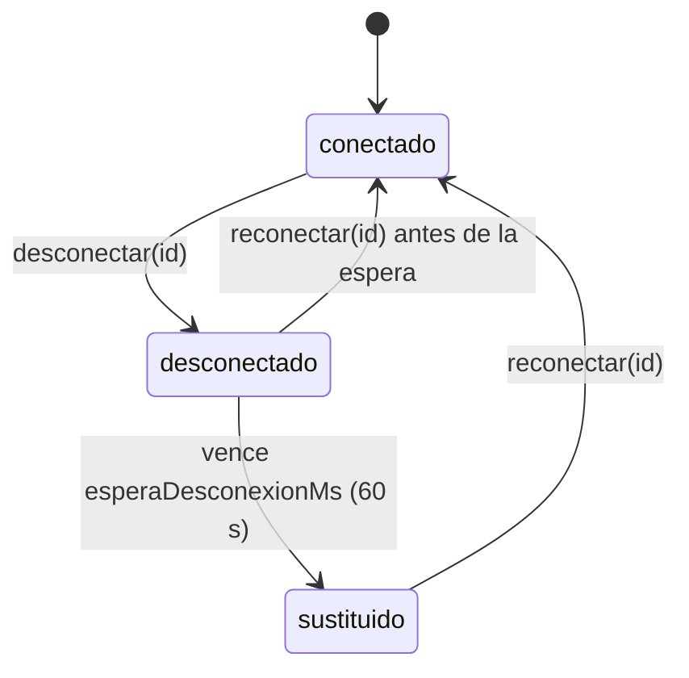
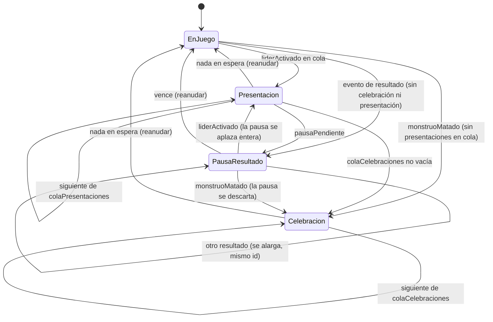

# El anfitrión de partida (`packages/anfitrion`)

**Resumen.** El `Anfitrion` es quien _hace de mesa_: guarda el estado de una partida, aplica cada
acción con el motor, mide el tiempo de las ventanas y envía `CERRAR_VENTANA` cuando vencen, hace
jugar a los bots, detiene la partida unos segundos para que todos vean a la vez las escenas
importantes (Líder, Monstruo matado, resultado) y, según el modo, gestiona el traspaso del
dispositivo (hot-seat) o las desconexiones (en línea). El motor no mide tiempo ni sabe quién es
humano: todo eso vive aquí. El paquete no depende de React ni de la red; se observa con
`suscribir()` y el contador `version`.

Lo usan dos sitios, con el mismo código:

- **La web, en local** (modos `local` y `bots`): `apps/web/src/juego/director-vivo.ts` reexporta
  `Anfitrion` como `DirectorVivo`. `App.tsx` crea uno con `DirectorVivo.nueva(...)` y la mesa lo lee
  como `FuenteMesa` (ver [WEB.md](WEB.md)). Al cargar una partida guardada,
  `apps/web/src/juego/guardado.ts` lo reconstruye con el constructor a partir del estado que devuelve
  `motor.cargar`.
- **El servidor, en línea** (modo `enLinea`): `apps/server/src/servidor.ts` crea **una instancia por
  sala** al empezar la partida y difunde su estado a cada jugador (ver
  [SERVIDOR_Y_PROTOCOLO.md](SERVIDOR_Y_PROTOCOLO.md)).

El paquete también contiene el **protocolo de red** (`protocolo.ts`), porque lo comparten el servidor y
el cliente web; se describe en [SERVIDOR_Y_PROTOCOLO.md](SERVIDOR_Y_PROTOCOLO.md). Para el motor
(`reducer`, pila, ventanas, eventos) ver [MOTOR.md](MOTOR.md); para el encaje general,
[ARQUITECTURA.md](ARQUITECTURA.md).

## Archivos

| Archivo               | Contenido                                                                                   |
| --------------------- | ------------------------------------------------------------------------------------------- |
| `src/anfitrion.ts`    | La clase `Anfitrion`, la interfaz `Reloj`, `RELOJ_REAL`, `OpcionesAnfitrion` y constantes.  |
| `src/config.ts`       | `ConfigAnfitrion`, modos, control de cada jugador y conversión a `ConfigPartida` del motor. |
| `src/motivos.ts`      | Por qué está desactivado cada botón de la interfaz (`motivosDe`, `accionesDeInterfaz`).     |
| `src/reloj-manual.ts` | `RelojManual`, un reloj controlable para tests y simulaciones.                              |
| `src/protocolo.ts`    | Mensajes Socket.IO y esquemas Zod (ver [SERVIDOR_Y_PROTOCOLO.md](SERVIDOR_Y_PROTOCOLO.md)). |
| `src/index.ts`        | Reexporta todo lo anterior.                                                                 |

Tests en `packages/anfitrion/test/`: `anfitrion.test.ts` (ventanas, bots, traspaso, desconexión,
límite por decisión), `celebracion.test.ts`, `pausa-resultado.test.ts` y `presentacion-lider.test.ts`.
Ver [PRUEBAS.md](PRUEBAS.md).

## Configuración (`config.ts`)

```ts
type ModoJuego = 'local' | 'bots' | 'enLinea';
type Control = 'humano' | NivelBot; // NivelBot = 'facil' | 'normal' (de @hts/bots)
```

| Modo      | Significado                                                                                         |
| --------- | --------------------------------------------------------------------------------------------------- |
| `local`   | Varios humanos en el mismo dispositivo (hot-seat), con o sin bots. Hay traspaso del dispositivo.    |
| `bots`    | Un humano contra bots en este dispositivo. La vista es siempre la del primer humano.                |
| `enLinea` | Cada humano en su dispositivo; el servidor pregunta por cada jugador. Hay desconexión y reconexión. |

`ConfigAnfitrion`:

| Campo             | Tipo                    | Uso                                                                           |
| ----------------- | ----------------------- | ----------------------------------------------------------------------------- |
| `modo`            | `ModoJuego`             | Ver tabla anterior.                                                           |
| `reglas`          | `Modo` (motor)          | `normal` o `dificil`.                                                         |
| `jugadores`       | `JugadorConfig[]`       | `{ id, nombre, control }`, en orden de asiento.                               |
| `semilla`         | `string`                | Semilla del motor y de los generadores de azar de cada bot.                   |
| `segundos`        | `Segundos`              | Duración de las ventanas: `desafio`, `modificadores`, `modificadoresDesafio`. |
| `dificultad`      | `Dificultad` (opcional) | Solo informativa (`facil`, `normal` o `mixta`).                               |
| `limiteDecisionS` | `number \| null` (opc.) | Límite por decisión de un humano, en segundos. Ausente o `null`: sin límite.  |

Funciones y constantes:

- `SEGUNDOS_POR_DEFECTO` = `{ desafio: 10, modificadores: 5, modificadoresDesafio: 10 }`.
- `semillaAleatoria()` — semilla basada en la hora y `Math.random`.
- `nivelDeBot(dificultad, indice)` — con `mixta` alterna `normal` (índices pares) y `facil`.
- `aConfigPartida(config)` — traduce a la `ConfigPartida` del motor: pasa los segundos a
  milisegundos (`duracionVentana…Ms`) y lista los bots en `opciones.bots`, porque los bots no cuentan
  para la victoria por rendición (D-43, ver [DUDAS_REGLAS.md](DUDAS_REGLAS.md)).

## Ciclo de vida

```ts
const a = Anfitrion.nueva(motor, config, reloj?, opciones?); // crea la partida con el motor
const b = new Anfitrion(motor, config, estado, reloj?, opciones?, eventosPrevios?); // partida cargada
a.suscribir(() => render(a.version));
a.enviar(actor, accion); // CodigoError | null
a.destruir(); // cancela todos los temporizadores
```

- El constructor crea un generador de azar por jugador (`${semilla}:${id}`), también para los
  humanos, por si un bot tiene que decidir por ellos. `alMando` empieza en el primer humano.
- **Partida cargada:** los `eventosPrevios` se guardan en `eventos`, pero se marcan como ya vistos
  (`eventosVistos`): al cargar no se celebran Monstruos ni se presentan Líderes antiguos, ni se
  hace una pausa de resultado.
- Tras cada cambio se llama a `actualizar()` (privado), que es el corazón del anfitrión: revisa los
  eventos nuevos, gestiona las detenciones, la cuenta de la ventana, el traspaso, los bots y el
  límite por decisión, y por último llama a `notificar()` (incrementa `version` y avisa a los
  suscriptores).
- `destruir()` marca la partida como terminada (`enviar` devuelve `PARTIDA_TERMINADA` a partir de
  entonces) y cancela todos los temporizadores. Lo llaman la web al salir de la mesa y el servidor al
  borrar una sala o volver al lobby.

### Consultas

| Método / propiedad                                   | Devuelve                                                                                                                                                       |
| ---------------------------------------------------- | -------------------------------------------------------------------------------------------------------------------------------------------------------------- |
| `estado`, `eventos`, `version`                       | Estado del motor, todos los eventos (sin filtrar) y contador de cambios.                                                                                       |
| `humanos`, `esHumano(id)`, `esBot(id)`               | Bot = control distinto de `humano` **o** humano sustituido por desconexión.                                                                                    |
| `observador`                                         | Jugador cuya vista se muestra en local: en `bots`, el primer humano; si no, `alMando`.                                                                         |
| `vista()`, `legales()`, `validar(a)`, `motivo(a)`    | Lo mismo, para el `observador` (`motivo` es un alias de `validar`, común con el cliente en línea).                                                             |
| `vistaDe(id)`, `legalesDe(id)`, `motivosDe(id)`      | Para un jugador concreto (los usa el servidor).                                                                                                                |
| `actorRequerido()`                                   | Quién debe actuar: el jugador de la `decision`, `elegir` o `tiradaInmediata` de la cima; el del turno si la pila está vacía; `null` en ventanas o con ganador. |
| `respondedoresPosibles()`                            | Humanos que pueden responder en la ventana abierta (local).                                                                                                    |
| `plazo`, `restanteMs()`                              | Cuenta de la ventana (`{ secuencia, duracionMs, fin }`; `fin = null` si está en pausa).                                                                        |
| `plazoDecision`, `restanteDecisionMs()`              | Límite por decisión del jugador requerido.                                                                                                                     |
| `celebracion`, `pausaResultado`, `presentacionLider` | La detención en curso de cada tipo, o `null`, y sus `restante…Ms()`.                                                                                           |
| `conexion(id)`                                       | `'conectado' \| 'desconectado' \| 'sustituido'`.                                                                                                               |

Mientras la partida está detenida, `legales()` y `legalesDe()` devuelven `[]` y `motivosDe()` marca
**todas** las acciones de interfaz con el código de la detención (ver más abajo).

## Tiempo: `Reloj` y `RelojManual`

El anfitrión nunca llama a `setTimeout` directamente; usa un `Reloj`:

```ts
interface Reloj {
  ahora: () => number;
  programar: (fn: () => void, ms: number) => unknown; // devuelve un id
  cancelar: (id: unknown) => void;
}
```

- `RELOJ_REAL` usa `Date.now`, `setTimeout` y `clearTimeout`. Es el valor por defecto.
- `RelojManual` (tests y simulaciones): el tiempo solo avanza con `avanzar(ms)`, que ejecuta **en
  orden** las tareas que vencen dentro de ese intervalo (una tarea puede programar otras y también
  se ejecutan si caen dentro). `t` es el instante actual y `pendientes` el número de tareas.

```ts
const reloj = new RelojManual();
const a = Anfitrion.nueva(motor, config, reloj, { retardoBotMs: 0 });
reloj.avanzar(10_000); // vence la ventana de desafío → CERRAR_VENTANA
```

El servidor también acepta un `reloj` en `crearServidor` (los tests de `apps/server` lo usan).

## Ventanas y límite por decisión

### Cuenta regresiva de las ventanas

Cuando la cima de la pila es una `ventanaDesafio` o `ventanaModificadores`, el anfitrión crea un
`Plazo` con la `secuencia` y la `duracionMs` de la ventana:

- **Ventana nueva o reiniciada** (cambia la `secuencia`: un Modificador jugado o un disparador la
  reabre): cuenta **completa**.
- Al vencer, si la cima sigue siendo la misma ventana (misma `secuencia`) y nadie está respondiendo,
  envía `{ tipo: 'CERRAR_VENTANA', secuencia }` como actor `SISTEMA`. El motor rechaza un cierre con
  una secuencia antigua, así que un temporizador atrasado no puede cerrar una ventana nueva.
- **Pausa de la cuenta:** en local, mientras un humano responde (`responder(id)`), la cuenta se para
  (`fin = null`) y se reanuda **completa** con `terminarRespuesta()`. Durante una detención la cuenta
  se congela con lo que le quedaba y se reanuda con ese resto.
- Si la cima deja de ser una ventana, el plazo se borra.

### Límite por decisión (`limiteDecisionS`)

Opcional (en línea lo elige el creador de la sala; validado entre 10 y 600 s). Cuando hay un
`actorRequerido` humano y no hay traspaso pendiente, se programa un temporizador. Si vence y la
situación no ha cambiado (misma clave `jugador:altura de la pila:número de eventos`), el **bot
normal** decide por él **esa vez** (`actuarConBot`). En las ventanas no hay límite por decisión: ahí
manda la cuenta de la ventana. Durante una detención el límite se congela (su `fin` se desplaza hasta
el final de la detención más lo que quedaba).

## Bots

- Un bot puede ser un asiento con `control: 'facil' | 'normal'`, o un humano **sustituido** (en línea,
  tras desconectarse) o que **agota su límite**: estos últimos los juega `BOTS.normal`.
- `programarBots()` programa `turnoDeBots()` tras `retardoBotMs` (700 ms por defecto) si hay trabajo
  para los bots y la partida no está detenida ni hay un humano respondiendo en local.
- `turnoDeBots()` hace **como mucho una acción** y vuelve a programarse tras el cambio:
  - **Ventana de desafío:** el primer bot que aún no ha pasado (y no es quien jugó la carta) desafía si
    su bot elige `DESAFIAR`; si no, `PASAR`.
  - **Ventana de Modificadores:** pregunta a cada bot; el primero que juega un `JUGAR_MODIFICADOR`
    legal termina el paso. Si ninguno juega, se apunta la `secuencia` en `botsEvaluaron` y no se les
    vuelve a preguntar en esa ventana: la cerrará la cuenta regresiva.
  - **Resto:** si el `actorRequerido` es un bot, decide.
- Red de seguridad (`actuarConBot`): si el bot no propone nada o propone algo ilegal, se juega la
  primera acción legal.
- Los bots reciben lo mismo que un humano: `{ vista, legales, catalogo, azar }` (ver
  [MOTOR.md](MOTOR.md) y la sección de bots de [ARQUITECTURA.md](ARQUITECTURA.md)).

## Traspaso del dispositivo (modo `local`)

En hot-seat solo hay una pantalla. El anfitrión decide de quién es la vista (`alMando`) y cuándo hay
que pasar el dispositivo (`traspaso`):

- Si el `actorRequerido` es otro humano, `traspaso` pasa a ser ese jugador y la interfaz muestra la
  pantalla de traspaso. `legales()` devuelve `[]` mientras tanto. El jugador confirma con
  `confirmarTraspaso()` y pasa a ser `alMando`.
- En una ventana, cualquier humano puede pedir responder: `responder(id)` pausa la cuenta, marca
  `respondiendo` y, si no es `alMando`, pide el traspaso. `terminarRespuesta()` reanuda la cuenta y
  devuelve el dispositivo al jugador que deba actuar después.
- Durante una detención el traspaso se **difiere** (`traspasoDiferido`) y se aplica al reanudar: así
  todos ven la escena en la misma pantalla antes de pasar el dispositivo. `confirmarTraspaso()` y
  `terminarRespuesta()` no hacen nada con la partida detenida.

## Desconexión y reconexión (modo `enLinea`)



- `desconectar(id)` (el servidor lo llama cuando un humano se queda sin conexiones abiertas, o al
  empezar si alguien no está conectado) programa la sustitución tras `esperaDesconexionMs`
  (`ESPERA_DESCONEXION_MS` = 60 000 ms). Solo afecta a humanos.
- Al vencer, el jugador pasa a `sustituido`: `esBot(id)` es cierto y el bot normal juega por él.
- `reconectar(id)` cancela la espera o quita la sustitución; el jugador recupera su asiento.
- Mientras está `desconectado` (antes de la sustitución) la partida espera por él como por cualquier
  humano; si hay `limiteDecisionS`, el límite sigue corriendo.

## Detenciones: presentación del Líder, celebración y pausa de resultado

Hay tres escenas en las que **la partida se detiene para todos a la vez** (en línea, todos los
jugadores las ven al mismo tiempo; en local, antes del traspaso):

| Detención              | Se activa con el evento                                                                                                                                           | Duración por defecto | Código que devuelve `enviar` |
| ---------------------- | ----------------------------------------------------------------------------------------------------------------------------------------------------------------- | -------------------- | ---------------------------- |
| Presentación del Líder | `liderActivado` (cada activación, también varias del mismo Líder en un turno)                                                                                     | 4000 ms              | `PRESENTACION_LIDER`         |
| Celebración            | `monstruoMatado` (una por Monstruo)                                                                                                                               | 4000 ms              | `CELEBRACION`                |
| Pausa de resultado     | `desafioResuelto`, `tiradaHeroe`, `ataqueResuelto`, `cartaAnulada`, o el `heroeEntra` / `objetoEquipado` / `magiaResuelta` que cierra la carta jugada (ver abajo) | 3000 ms              | `PAUSA_RESULTADO`            |

La pausa de resultado acompaña a las escenas de resultado de la interfaz (`Escenario.tsx` en la web,
ver [WEB.md](WEB.md)): el anfitrión detecta los mismos eventos. Para los tres eventos de cierre
(`heroeEntra`, `objetoEquipado`, `magiaResuelta`) solo cuenta el que corresponde a la última
`cartaJugada` (mismo jugador y carta); un Héroe que entra en un Grupo por el efecto de otra carta no
provoca pausa.

### Mecanismo común

- `detenida()` (privado) dice si la partida está detenida y con qué código: comprueba, por este
  orden, presentación, celebración y pausa. **Nunca hay dos a la vez.**
- `detener(fin)` congela todo hasta `fin`:
  - la cuenta de la ventana (`restantePlazoCongelado`, y la ventana queda con `fin = null`);
  - el límite por decisión (`restanteDecisionCongelado`; `plazoDecision.fin` pasa a
    `fin + restante`);
  - el traspaso (`traspasoDiferido`);
  - los bots (se cancela su temporizador).
    Si ya estaba detenida (una detención sigue a otra, o la pausa se alarga), lo congelado se conserva y
    solo se mueve el fin.
- `reanudar()` deshace la detención: reanuda la ventana con lo que le quedaba (si nadie está
  respondiendo), aplica el traspaso diferido (o el que haga falta ahora), vuelve a programar el límite
  por decisión con su resto (si no hay traspaso) y programa los bots.
- Al terminar una presentación o una celebración se llama a `siguienteDetencion()`; solo si no queda
  ninguna se llama a `reanudar()`. Al terminar una pausa de resultado se reanuda directamente.

**Qué se bloquea:** `enviar` rechaza cualquier acción de un jugador con el código de la detención;
`legales()`/`legalesDe()` devuelven `[]`; `motivosDe()` devuelve todas las acciones de interfaz con
ese código (la web lo muestra como motivo del botón desactivado); `responder`, `terminarRespuesta` y
`confirmarTraspaso` no hacen nada. Las acciones del `SISTEMA` sí pasan, pero el temporizador de la
ventana está parado, así que no se envía ningún `CERRAR_VENTANA` durante la detención.

### Cola, prioridades y orden

```ts
private siguienteDetencion(): boolean  // presentaciones → celebraciones → pausa pendiente
```

- Cada `liderActivado` se encola en `colaPresentaciones` y cada `monstruoMatado` en
  `colaCelebraciones`, con un `id` correlativo por anfitrión (distingue dos escenas seguidas de la
  misma carta).
- Si no hay presentación ni celebración en curso, `siguienteDetencion()` empieza la siguiente:
  primero **todas las presentaciones de Líder** (el bono del Líder se ve antes que el resultado de la
  tirada o que el Monstruo matado), luego **las celebraciones**, y por último la **pausa de resultado
  aplazada** (`pausaPendiente`).
- **La celebración tapa al resultado:** si hay una celebración en curso o en cola, no se crea pausa
  de resultado; y al empezar una celebración se cancela la pausa en curso o aplazada.
- **La presentación aplaza al resultado:** si llega un resultado con una presentación en curso o en
  cola, la pausa queda pendiente; si una presentación empieza con una pausa en curso, esa pausa se
  cancela y se aplaza **entera** (al volver dura lo configurado completo).
- **Resultados encadenados:** si llega otro resultado durante una pausa de resultado, la pausa se
  **alarga** desde ese momento y conserva su `id` (para la interfaz es la misma pausa, sin cortes).



Ejemplo típico: un jugador ataca a un Monstruo, su Líder suma un bono a la tirada y la tirada
mata al Monstruo. En los eventos llegan `liderActivado`, `ataqueResuelto` y `monstruoMatado`. El
anfitrión muestra la presentación del Líder (4 s), después la celebración del Monstruo (4 s); la
pausa de resultado del ataque se descarta porque la celebración la tapa.

### Victoria

Cuando el estado tiene `ganador`:

- no se encolan presentaciones nuevas ni se crea pausa de resultado;
- se cancelan la pausa de resultado (y la pendiente), la presentación en curso y su cola, los
  temporizadores de ventana, bots y decisión, el traspaso y la respuesta en curso;
- **la celebración del Monstruo que da la victoria sigue su curso** (y las que estén en cola); la
  interfaz pasa a la pantalla de victoria después.

### Carga de partida

Los eventos anteriores a crear el anfitrión no se revisan, así que una partida cargada empieza sin
detenciones aunque su último evento fuera un Monstruo matado o un resultado.

## `OpcionesAnfitrion`

Cuarto/quinto argumento de `Anfitrion.nueva` / del constructor. Todas en milisegundos y opcionales.

| Opción                | Por defecto (constante)                    | Uso                                                                                  |
| --------------------- | ------------------------------------------ | ------------------------------------------------------------------------------------ |
| `retardoBotMs`        | 700 (`RETARDO_BOT_POR_DEFECTO_MS`)         | Pausa antes de cada acción de un bot, para poder seguir la partida.                  |
| `esperaDesconexionMs` | 60 000 (`ESPERA_DESCONEXION_MS`)           | En línea: espera antes de que un bot sustituya a un desconectado.                    |
| `celebracionMs`       | 4000 (`CELEBRACION_POR_DEFECTO_MS`)        | Duración de cada celebración de Monstruo. `0` la desactiva.                          |
| `pausaResultadoMs`    | 3000 (`PAUSA_RESULTADO_POR_DEFECTO_MS`)    | Duración de la pausa de resultado (la escena más larga, el duelo). `0` la desactiva. |
| `presentacionLiderMs` | 4000 (`PRESENTACION_LIDER_POR_DEFECTO_MS`) | Duración de cada presentación de Líder. `0` la desactiva.                            |

Quién las cambia:

- **Web, compilación `e2e`** (`apps/web/src/juego/opciones.ts`, `OPCIONES_DIRECTOR`):
  `retardoBotMs: 40`, `celebracionMs: 300`, `pausaResultadoMs: 50`, `presentacionLiderMs: 50`. En el
  resto de modos, los valores por defecto.
- **Servidor:** variables de entorno `RETARDO_BOT_MS`, `CELEBRACION_MS`, `PAUSA_RESULTADO_MS` y
  `PRESENTACION_LIDER_MS` (ver [SERVIDOR_Y_PROTOCOLO.md](SERVIDOR_Y_PROTOCOLO.md#variables-de-entorno)).
  `esperaDesconexionMs` no tiene variable; solo la cambian los tests.

Otras exportaciones de `anfitrion.ts`: los tipos `Celebracion`, `PresentacionLider`,
`PausaResultado`, `Plazo`, `PlazoDecision` y `EstadoConexion`.

## Motivos de las acciones desactivadas (`motivos.ts`)

La interfaz enseña botones aunque la acción no sea legal ahora, para explicar por qué está
desactivada.

- `accionesDeInterfaz(motor, estado, jugador)` construye la lista de acciones "de botón" con
  información que el propio jugador puede ver: `ROBAR`, `RENOVAR_MANO`, `FIN_TURNO`; `USAR_HABILIDAD`
  de su Líder y de sus Monstruos si su definición tiene una pasiva `habilidad`; `JUGAR_CARTA` por cada
  carta de su mano (los Objetos, con el primer Héroe sin Objeto como `objetivo` provisional);
  `TIRAR_HEROE` por cada Héroe de su Grupo; `ATACAR` por cada Monstruo del centro.
- `motivosDe(motor, estado, jugador)` valida cada una con `motor.validar` y devuelve
  `{ accion, codigo }` de las que **no** son legales.

El servidor envía estos motivos en cada `EstadoPartida`, porque el cliente en línea no tiene el
estado completo para calcularlos. Con la partida detenida, el anfitrión devuelve todas las acciones
de interfaz con el código de la detención.

## Cómo añadir algo

- **Una detención nueva:** añadir su estado (`…Actual`, cola si puede repetirse, temporizador),
  detectarla en `actualizar()`, darle un lugar en `detenida()` y en `siguienteDetencion()`, usar
  `detener(fin)` al empezar y `siguienteDetencion()`/`reanudar()` al terminar, cancelarla en
  `destruir()` y en la victoria, añadir el código de error al motor y el campo a `EstadoPartida` en
  `protocolo.ts`. Con test en `packages/anfitrion/test/` usando `RelojManual`.
- **Una opción nueva:** añadirla a `OpcionesAnfitrion`, con su constante por defecto exportada y, si
  el servidor debe poder fijarla, a `VARIABLES` en `apps/server/src/principal.ts`.
