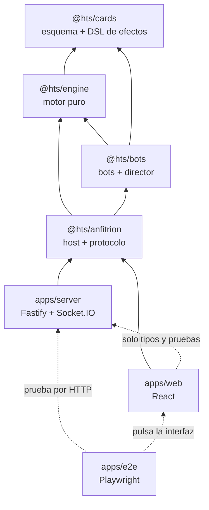
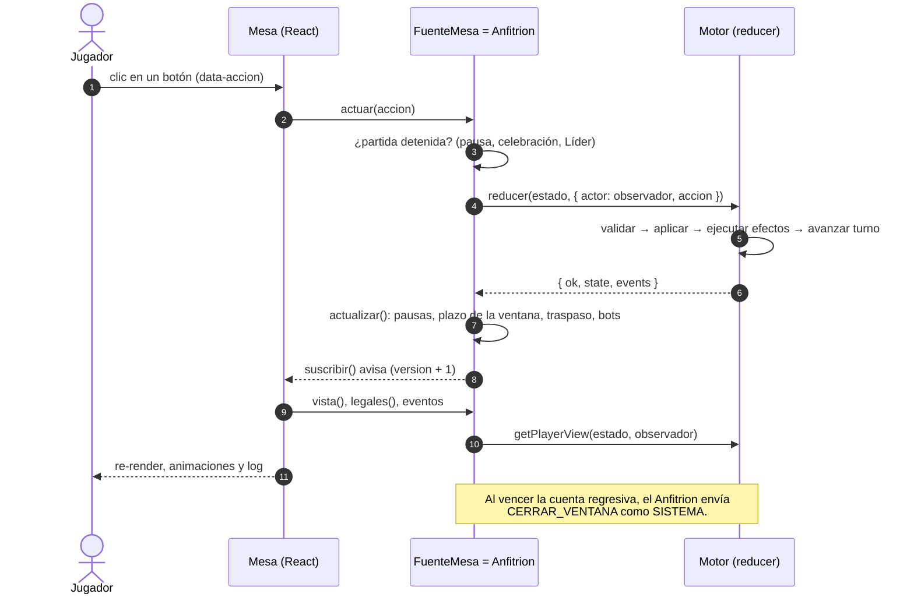
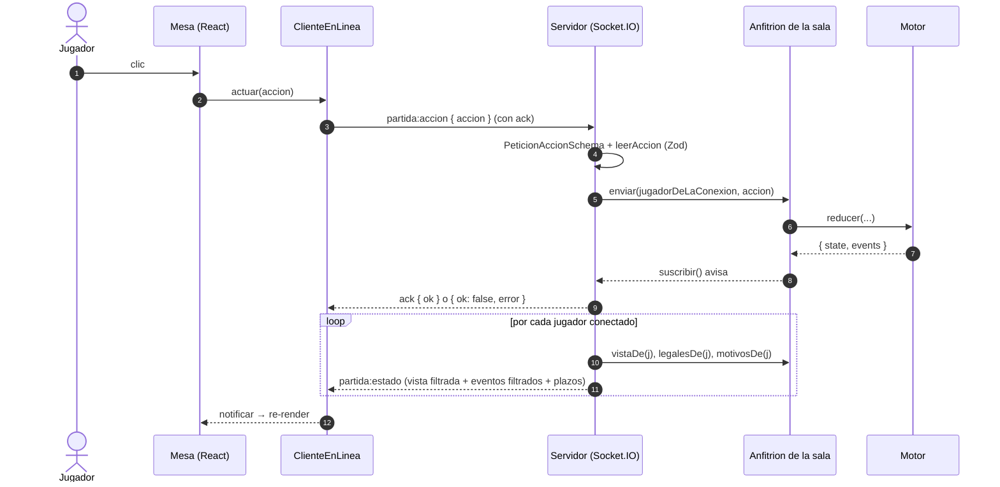

# Arquitectura

Versión digital en español del juego de cartas _Here to Slay_ para uso personal: de 2 a 6
jugadores, en el mismo dispositivo (hot-seat), contra bots o en línea con un servidor propio. Es un
monorepo pnpm en TypeScript estricto con cuatro paquetes de lógica (`packages/`) y tres
aplicaciones (`apps/`).

La idea central: **un motor de reglas puro y determinista** que no sabe nada de tiempo, red ni
pantallas; **un anfitrión** que lo envuelve y añade temporizadores, bots y pausas; y dos formas de
usar ese anfitrión: **en el navegador** (partidas locales) o **en un servidor autoritativo**
(partidas en línea), que envía a cada jugador solo su **vista filtrada**.

## Índice de la documentación técnica

- [MOTOR.md](MOTOR.md) — `packages/engine`: estado, pila, turno, tiradas, eventos y vistas.
- [CARTAS_Y_EFECTOS.md](CARTAS_Y_EFECTOS.md) — `packages/cards`: esquema de cartas, DSL de
  efectos e intérprete.
- [BOTS.md](BOTS.md) — `packages/bots`: bots fácil y normal, director y simulación.
- [ANFITRION.md](ANFITRION.md) — `packages/anfitrion`: temporizadores, pausas, bots y conexiones.
- [SERVIDOR_Y_PROTOCOLO.md](SERVIDOR_Y_PROTOCOLO.md) — `apps/server` y el protocolo Socket.IO.
- [WEB.md](WEB.md) — `apps/web`: pantallas, mesa, estado e i18n.
- [ESCRITORIO.md](ESCRITORIO.md) — ejecutable de escritorio (`pnpm empaquetar`).
- [PRUEBAS.md](PRUEBAS.md) — Vitest, simulación y Playwright.
- [GLOSARIO.md](GLOSARIO.md) — términos del juego y del código.
- [EN_LINEA.md](EN_LINEA.md) — cómo jugar en línea (guía de uso).
- [REGLAS.md](REGLAS.md) — reglas como especificación (`R-xxx`).
- [DUDAS_REGLAS.md](DUDAS_REGLAS.md) — ambigüedades y decisiones (`D-xx`).

## Paquetes y aplicaciones

| Pieza                | Paquete npm      | Depende de                                    |
| -------------------- | ---------------- | --------------------------------------------- |
| `packages/cards`     | `@hts/cards`     | `zod`                                         |
| `packages/engine`    | `@hts/engine`    | `@hts/cards`                                  |
| `packages/bots`      | `@hts/bots`      | `@hts/engine`, `@hts/cards`                   |
| `packages/anfitrion` | `@hts/anfitrion` | `@hts/engine`, `@hts/bots`, `@hts/cards`      |
| `apps/server`        | `@hts/server`    | `@hts/anfitrion`, `@hts/engine`, `@hts/cards` |
| `apps/web`           | `@hts/web`       | `@hts/anfitrion`, `@hts/engine`, `@hts/bots`… |
| `apps/e2e`           | `@hts/e2e`       | (prueba la web compilada y el servidor)       |

- **`packages/cards`**: esquema Zod de las cartas (`schema.ts`), validación de `cartas.es.json`,
  DSL de efectos (`efectos/efectos.json`) y scripts de recursos (`pnpm recursos`, `copy:images`,
  `validate:cards`).
- **`packages/engine`**: el motor de reglas. `crearMotor` devuelve `reducer`, `validar`,
  `accionesLegales`, `getPlayerView`, `serializar`/`cargar`; además exporta `describirEvento`.
  Puro: sin E/S, sin tiempo, sin aleatoriedad externa.
- **`packages/bots`**: `botFacil`, `botNormal` y `jugarPartida`, un host sin pantalla para los tests
  y `pnpm sim`.
- **`packages/anfitrion`**: la clase `Anfitrion` (host de una partida: cuentas regresivas, bots,
  pausas, traspaso del dispositivo, desconexiones) y `protocolo.ts` (mensajes Socket.IO y esquemas
  Zod).
- **`apps/server`**: Fastify + Socket.IO. Salas en memoria, valida cada mensaje, ejecuta un
  `Anfitrion` por sala y sirve la web compilada. También es la base del ejecutable de escritorio.
- **`apps/web`**: React 19 + Vite + Zustand + Tailwind 4 + Framer Motion. La mesa lee de una
  `FuenteMesa`: el `Anfitrion` en local o `ClienteEnLinea` en línea. (`@hts/server` solo figura
  como dependencia de desarrollo, para tipos y pruebas.)
- **`apps/e2e`**: Playwright. Partidas completas pilotadas por el bot normal, accesibilidad
  (axe-core) y rendimiento.

Las dependencias van en un solo sentido: el motor no conoce a los bots, los bots no conocen al
anfitrión y nada de `packages/` conoce React ni Socket.IO (Socket.IO solo aparece como nombres de
mensaje y esquemas Zod en `packages/anfitrion/src/protocolo.ts`).

Los recursos oficiales (`Referencias/cartas.es.json`, el reglamento y las imágenes en
`assets/cartas/`) **no están en el repositorio**; se instalan con `pnpm recursos`. Ver
[CARTAS_Y_EFECTOS.md](CARTAS_Y_EFECTOS.md#recursos).

## Principios de diseño

1. **Motor puro y determinista** (`packages/engine`).
   - `reducer(state, { actor, accion })` devuelve un estado nuevo y una lista de eventos; nunca muta
     el estado recibido (lo clona y trabaja sobre un borrador).
   - Todo el azar sale de un RNG con semilla que vive **dentro** del `GameState` (`rng`), así
     que la misma semilla y las mismas acciones producen exactamente la misma partida.
   - El motor **no mide el tiempo**. Las ventanas de desafío y de Modificadores llevan una
     `duracionMs` y una `secuencia`; quien cierra la ventana es el host, enviando `CERRAR_VENTANA`
     como actor `SISTEMA` cuando vence su temporizador.
   - Las decisiones pendientes forman una **pila** (`state.pila`): solo actúa quien indica la cima.
2. **Host con temporizadores** (`packages/anfitrion`). El `Anfitrion` es el único sitio con relojes
   (interfaz `Reloj`, sustituible por `RelojManual` en tests): cuentas regresivas de las ventanas,
   pausa antes de que actúe un bot, pausas para que todos vean un resultado, celebración de
   Monstruos, presentación de Líderes, límite opcional por decisión y espera por desconexión.
   El mismo código sirve para el navegador y para el servidor.
3. **Servidor autoritativo** (`apps/server`). Los clientes solo envían **intenciones** (`Accion`);
   el servidor valida su forma con Zod, fija el actor al jugador de esa conexión y la pasa al
   `Anfitrion`, que la valida con el motor. Ningún cliente toca el estado.
4. **Vistas filtradas.** Cada jugador recibe `getPlayerView(estado, jugador)`: su mano, el número
   de cartas de las demás, nunca el orden del mazo ni el RNG ni los dados forzados. Los eventos
   pasan por `eventoParaJugador`, que oculta las cartas robadas, sacadas o dadas a quien no debe
   verlas.
   Los bots reciben exactamente lo mismo que un humano.

## Flujo de una acción de punta a punta

### En local (este dispositivo o contra bots)

El `Anfitrion` corre dentro del navegador (reexportado como `DirectorVivo` en
`apps/web/src/juego/director-vivo.ts` y cargado con `import()`).

### En línea

El `Anfitrion` corre en el servidor (uno por sala). El navegador usa `ClienteEnLinea`
(`apps/web/src/enlinea/cliente.ts`), que implementa la misma `FuenteMesa` con lo que recibe.

Detalles en [ANFITRION.md](ANFITRION.md) y [SERVIDOR_Y_PROTOCOLO.md](SERVIDOR_Y_PROTOCOLO.md).

## Dónde vive cada cosa

| Quiero cambiar…                           | Archivo                                   |
| ----------------------------------------- | ----------------------------------------- |
| Tipos: estado, acciones, eventos, errores | `packages/engine/src/tipos.ts`            |
| Si una acción es legal                    | `packages/engine/src/validar.ts`          |
| Qué hace una acción                       | `packages/engine/src/aplicar.ts`          |
| Jugadas, ventanas, tiradas, fin de turno  | `packages/engine/src/flujo.ts`            |
| Preparación de la partida                 | `packages/engine/src/crear.ts`            |
| Condiciones de victoria                   | `packages/engine/src/victoria.ts`         |
| Rendición (D-43)                          | `packages/engine/src/rendicion.ts`        |
| Lo que ve cada jugador                    | `packages/engine/src/vista.ts`            |
| Texto del historial                       | `packages/engine/src/log.ts`              |
| Intérprete del DSL de efectos             | `packages/engine/src/interprete.ts`       |
| Pasivas, disparadores y bonos             | `packages/engine/src/pasivas.ts`          |
| Destruir, sacrificar, arrebatar           | `packages/engine/src/grupo.ts`            |
| Pasos `custom`                            | `packages/engine/src/customs.ts`          |
| Esquema de las cartas                     | `packages/cards/src/schema.ts`            |
| Efecto de una carta                       | `packages/cards/src/efectos/efectos.json` |
| Esquema del DSL                           | `packages/cards/src/efectos/esquema.ts`   |
| Heurísticas de los bots                   | `packages/bots/src/normal.ts`             |
| Temporizadores, pausas, desconexiones     | `packages/anfitrion/src/anfitrion.ts`     |
| Mensajes de red y su validación           | `packages/anfitrion/src/protocolo.ts`     |
| Salas y servidor                          | `apps/server/src/servidor.ts`             |
| Pantallas                                 | `apps/web/src/pantallas/`                 |
| Mesa de juego                             | `apps/web/src/pantallas/mesa/`            |
| Textos de la interfaz                     | `apps/web/src/i18n/es.json`               |
| Interfaz común local/en línea             | `apps/web/src/juego/fuente.ts`            |

## Decisiones de diseño y por qué

- **Reducer puro con eventos.** Permite tests exactos (estado y eventos esperados), partidas
  reproducibles (`propiedades.test.ts` comprueba el determinismo), guardar/cargar con un simple
  JSON y ejecutar el mismo motor en el navegador y en el servidor. Los eventos alimentan el log
  (`describirEvento`), las animaciones y las pausas del anfitrión sin que el motor sepa de ellas.
- **El tiempo fuera del motor.** Un temporizador en el reducer lo haría impuro y no reproducible.
  Por eso las ventanas tienen `secuencia`: si un Modificador reinicia la cuenta o un disparador la
  pausa, la secuencia cambia y un `CERRAR_VENTANA` atrasado se rechaza con `SECUENCIA_OBSOLETA`.
- **Pila de decisiones.** Los efectos de las cartas se encadenan (un efecto obliga a otro jugador a
  elegir, un disparador interrumpe una ventana, jugar "inmediatamente" abre otra ventana de
  desafío…). Una pila en el estado, con un único jugador que puede actuar en la cima, modela
  todo eso de forma serializable.
- **DSL de efectos en JSON.** La mayoría de las cartas se describen con pasos genéricos
  (`efectos.json`), validados con Zod al importar; solo lo que no encaja es un paso `custom` en
  TypeScript. Así añadir o corregir una carta rara vez toca el motor.
- **`accionesLegales` generada con `validar`.** Se generan candidatas y se filtran con la misma
  función que usa el reducer, así que la lista nunca contradice al reducer; la UI y los bots usan
  esa lista.
- **Bots con la misma API que un humano.** Reciben vista filtrada y acciones legales: no pueden
  hacer trampas y sirven para sustituir a un jugador desconectado o para pilotar los e2e.
- **Un único host compartido.** `Anfitrion` vive en `packages/` para que el modo local y el
  servidor tengan exactamente el mismo comportamiento (pausas, bots, cuentas regresivas).
- **Recursos fuera del repositorio.** El repositorio es público y el arte y los textos son de
  Unstable Games; la web los lee al compilar (módulo virtual `virtual:cartas`) y los tests que los
  necesitan se saltan con `describe.skipIf` si no están.
- **Ambigüedades explícitas.** Cuando el reglamento no es claro, se registra una `D-xx` en
  [DUDAS_REGLAS.md](DUDAS_REGLAS.md), se aplica la lectura más literal y el código lo cita
  (`// D-xx` o `// TODO(regla) D-xx`).
