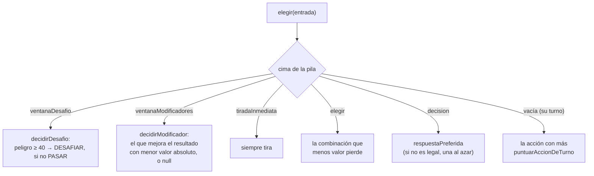

# Bots (`packages/bots`)

`@hts/bots` contiene dos jugadores automáticos, `botFacil` (al azar con tres ajustes) y
`botNormal` (heurísticas por prioridades), y `jugarPartida`, un host sin pantalla que enfrenta bots
entre sí para los tests y la simulación (`pnpm sim`). Un bot recibe **exactamente lo mismo que un
humano**: su vista filtrada y sus acciones legales. No puede ver manos ajenas, el mazo ni el RNG, y
siempre juega a través del `reducer` del motor ([MOTOR.md](MOTOR.md)).

Los bots se usan en tres sitios: en las partidas contra bots (web local y salas en línea), para
sustituir a un jugador desconectado o que agota su tiempo ([ANFITRION.md](ANFITRION.md)) y para
pilotar las pruebas e2e ([PRUEBAS.md](PRUEBAS.md)).

## Archivos

| Archivo                    | Contenido                                                    |
| -------------------------- | ------------------------------------------------------------ |
| `src/tipos.ts`             | `Bot`, `EntradaBot`, `NivelBot`                              |
| `src/facil.ts`             | `botFacil`                                                   |
| `src/normal.ts`            | `botNormal`                                                  |
| `src/analisis.ts`          | `Analisis`, probabilidades de 2d6, valor de cartas y efectos |
| `src/director.ts`          | `jugarPartida`, `ErrorDirector`                              |
| `src/scripts/simular.ts`   | `pnpm sim`                                                   |
| `src/index.ts`             | Exportaciones y `BOTS` (`{ facil, normal }`)                 |
| `test/heuristicas.test.ts` | Situaciones concretas del bot normal                         |
| `test/simulacion.test.ts`  | 1.000 partidas, duelo normal contra fácil, determinismo      |

## Interfaz de un bot

```ts
interface EntradaBot {
  vista: VistaJugador; // getPlayerView(estado, yo)
  legales: readonly Accion[]; // accionesLegales(estado, yo)
  catalogo: Catalogo; // id → Carta
  azar: () => number; // [0, 1), generador propio del bot, con semilla
}

interface Bot {
  nivel: 'facil' | 'normal';
  elegir: (entrada: EntradaBot) => Accion | null;
}
```

- `elegir` devuelve una de las acciones legales. `null` significa "no hago nada", y solo tiene
  sentido en una ventana (no desafiar, no jugar Modificador). Quien llama al bot decide qué hacer
  con un `null` donde hace falta una acción (el director y el anfitrión usan la primera legal).
- `azar` es un generador sfc32 propio de cada jugador (`crearRng('<semilla>:<id>')`), así que una
  partida entre bots con la misma semilla se repite exactamente.
- `BOTS` (`index.ts`) asocia cada `NivelBot` a su bot: `BOTS.facil`, `BOTS.normal`.

## `botFacil` (`facil.ts`)

Elige al azar entre sus acciones legales, con tres ajustes:

- **Ventana de desafío**: desafía con probabilidad 0,1 (si tiene carta de Desafío); si no, pasa.
- **Ventana de Modificadores**: con probabilidad 0,1 juega una acción legal al azar; si no, `null`.
- **Su turno con la pila vacía**: no elige `FIN_TURNO` mientras tenga otras acciones.

En el resto (decisiones de efectos, `elegir`, tirada inmediata) elige cualquier acción legal.

## `botNormal` (`normal.ts`)

Puntúa las opciones con heurísticas sobre la información visible. Sus prioridades:

1. Ganar si puede (matar el Monstruo decisivo, completar el Grupo).
2. Atacar Monstruos con buena probabilidad de éxito.
3. Jugar Héroes de clases que le faltan y tirar por los efectos más útiles.
4. Objetos (máscaras que añaden clase, malditos al rival más peligroso) y Magias.
5. Desafiar cartas peligrosas; jugar Modificadores solo si cambian el resultado a su favor.
6. En las decisiones de efectos, perjudicar al rival más peligroso y perder lo menos valioso.

Según la cima de la pila (`vista.pila`):



Para no ser del todo predecible, `mejor()` suma a cada puntuación un desempate aleatorio menor que
0,01.

### Turno propio (`puntuarAccionDeTurno`)

- `FIN_TURNO`: 0.
- `ROBAR`: 9.
- `RENOVAR_MANO`: 12 si le queda como mucho 1 carta y tiene 3 PA; si no, −5.
- `USAR_HABILIDAD`: 14 si algún rival tiene cartas en la mano; si no, −1.
- `ATACAR`: `P(éxito) · premio − P(fracaso) · coste − 15`. El premio es 600 si ese Monstruo le da
  la victoria (110 si no); el coste, 45 si el fracaso obliga a SACRIFICAR (20 si no).
- `TIRAR_HEROE`: `P(éxito) · valorPrograma − 4`.
- `JUGAR_CARTA` de un Héroe: 22, +30 si es de una clase nueva, +500 si completa el Grupo, más
  `0,6 · P(éxito) · valorPrograma`.
- `JUGAR_CARTA` de una Magia: `10 + valorPrograma · 0,8` (0,4 si ningún rival tiene Héroes).
- `JUGAR_CARTA` de un Objeto maldito: `14 + amenaza del dueño / 6` en un Héroe rival; −50 en uno
  propio.
- `JUGAR_CARTA` de una máscara: 35 si sube el número de clases (+500 si completa el Grupo); si no,
  −10.
- `JUGAR_CARTA` de otro Objeto: 18 en un Héroe propio; −50 en uno rival.

Las probabilidades salen de `probRango` con el bono estimado (`Analisis.bono`). Como `ROBAR` vale
9 y `FIN_TURNO` 0, el bot no termina el turno mientras tenga algo que puntúe más.

### Ventanas

- **Desafío** (`decidirDesafio`): suma un "peligro" a la carta del rival: +15 si su dueño es el
  rival más peligroso y le iguala o supera; para un Héroe, +15 si es de una clase que le falta, +100
  si con ella completaría el Grupo y un tercio del valor de su efecto; para una Magia, 10 + la mitad
  de su valor; para un Objeto, +40 si es un maldito sobre un Héroe propio y +20 si es una máscara.
  Desafía si el peligro llega a 40.
- **Modificadores** (`decidirModificador`): calcula los totales actuales de la ventana
  (`totalesActuales`: dados + Modificadores + bono estimado) y, para cada Modificador legal, cómo
  cambia el resultado (`puntuarResultado`): en una tirada propia, éxito frente a fracaso; en un
  ataque, éxito > nada > fracaso; en un desafío, quién gana. Solo interviene en tiradas ajenas si
  ese jugador va cerca de él o por delante (`importa`). Juega el que más mejora y, a igualdad, el de
  menor valor absoluto; si ninguno mejora, `null`.

### Decisiones (`respuestaPreferida`)

- `ver`: `{ ok: true }`.
- `confirmar`: siempre sí.
- `oculta` (SACAR a ciegas): una posición al azar.
- `valor` (El Cuerno Protector): el máximo si la ventana tiene una tirada suya; si no, el mínimo.
- `jugador`: el rival con más `amenaza + cartas en mano + 3 · Héroes`; con `heroe_dodgy_dealer`
  (intercambiar manos), el que más cartas tiene.
- `destruir`, `arrebatar`: el Héroe cuya pérdida más perjudica a su dueño (`interesEnQuitar`:
  valor del Héroe + amenaza del dueño).
- `objetivoObjeto`: preferentemente un Héroe propio.
- `sacrificar`, `darHeroe`: el Héroe propio menos valioso (`valorHeroe`: más si aporta una clase
  única, según su efecto y si lleva Objeto).
- `descartar`, `dar`: las cartas menos valiosas (`valorEnMano`). Con `heroe_qi_bear` descarta
  tantas cartas poco valiosas como Héroes rivales haya, hasta el máximo.
- `devolverObjeto`: su propio Objeto maldito o, si no, el Objeto normal de un rival.
- `jugarInmediato`: la carta más valiosa.
- `ordenarMazo`: el orden en que se le proponen.
- El resto (`tomarDeMano`, `recuperarDescarte`, `elegirDelMazo`…): la carta más valiosa.

Si la respuesta preferida no está entre las legales, elige una legal al azar. En las elecciones de
penalización de Monstruo (`elegir`) toma la combinación que menos valor suma.

## `analisis.ts`

- `probRango(rango, bono)` y `probAlMenos(n, bono)`: probabilidad de que 2d6 + bono caiga en un
  rango (distribución exacta de 2d6).
- Clase `Analisis` (se construye con la `EntradaBot`):
  - `carta(uid)`, `jugador(id)`, `rivales`, `cima`;
  - `clases(j)`: clases del Grupo con el Líder (usa `desgloseClases` del motor con lo visible) y
    `claseDeHeroe(heroe, objeto)` (máscaras);
  - `amenaza(j)`: lo cerca que está un jugador de ganar. En modo normal,
    `max(monstruos · 33, clases · 16) + Héroes · 2`; en difícil,
    `max(monstruos · 25 + clases · 5, clases · 14 + monstruos · 10) + Héroes · 2`;
  - `rivalLider`: el rival con más amenaza;
  - `ganaConUnMonstruo(j)`, `ganaConClases(j, clases)`: condiciones de victoria según el modo;
  - `bono(jugador, contexto, heroe?, tirada?)`: bono estimado con las pasivas visibles (Líder,
    Monstruos, Objetos equipados, `bonoPorModificadorRival`) y los temporales públicos. Lee las
    definiciones del DSL (`DEFINICIONES_EFECTOS`).
- `valorPrograma(programa)`: valor aproximado de un efecto sumando sus pasos (`robar` 8 por carta,
  `robarHasta` 20, `destruir` 25 por Héroe, `arrebatar` 28, `sacar`/`sacarDeCada`/`tomarDeManoVista`
  10, `jugadorDebe` 22 si es sacrificar o 9 por carta, `descartar` −5 por carta obligatoria,
  búsqueda en el descarte 10, `jugarInmediato` 6, `bonoTurno`/`proteccion` 7, `custom` 15, el resto
  3).
- `valorEnMano(carta)`: valor de tener una carta (Héroe 25 + mitad del efecto + facilidad de la
  tirada, Magia 18 + mitad del efecto, Objeto 20, maldito 16, Modificador 12 + su mayor valor
  absoluto, Desafío 22).

Si se añade un paso al DSL, conviene darle un valor en `valorPrograma`
([CARTAS_Y_EFECTOS.md](CARTAS_Y_EFECTOS.md#guía-añadir-o-completar-una-carta)).

## `jugarPartida` (`director.ts`)

`jugarPartida(motor, config, bots, opciones?)` juega una partida completa entre bots sin esperar
tiempo real y devuelve `{ estado, ganador, acciones, turnos, cartasJugadas }`.

| Opción        | Por defecto      | Qué hace                                                        |
| ------------- | ---------------- | --------------------------------------------------------------- |
| `semillaBots` | `config.semilla` | Semilla de los generadores de los bots (`<semilla>:<id>`)       |
| `maxAcciones` | 20.000           | Tope de seguridad; al alcanzarlo, la partida acaba sin ganador  |
| `alAplicar`   | —                | Se llama tras cada acción con el envío, el estado y los eventos |

En cada paso mira la cima de la pila:

- **Pila vacía**: actúa el jugador del turno (si el bot devuelve `null`, su primera acción legal).
- **Ventana de desafío**: pregunta al primer rival que no ha pasado, en orden desde el jugador del
  turno; si no desafía, pasa.
- **Ventana de Modificadores**: pregunta a todos en orden; si uno juega un Modificador, se aplica y
  se vuelve a empezar (la ventana se ha reiniciado). Si en una ronda completa nadie juega nada,
  envía `CERRAR_VENTANA` como `SISTEMA` (equivale a que venza la cuenta regresiva).
- **`tiradaInmediata`, `elegir`, `decision`**: responde el jugador indicado.

Cualquier acción ilegal o situación imposible (un `efecto` en la cima sin nada encima, un jugador
sin acciones) lanza `ErrorDirector`: los tests lo usan para detectar bloqueos del motor.

## Simulación

`pnpm sim [n] [semilla]` (`src/scripts/simular.ts`; por defecto 200 partidas y semilla `sim`)
simula partidas con el catálogo real (necesita `Referencias/cartas.es.json`):

- la partida `i` tiene `2 + (i mod 5)` jugadores, alterna modo normal y difícil, y alterna bots
  normal y fácil entre los asientos;
- muestra el tiempo total y por partida, las partidas sin ganador, los turnos y acciones de media,
  las victorias de cada nivel por asiento, los motivos de victoria por modo y las 10 cartas más
  jugadas.

El test `packages/bots/test/simulacion.test.ts` (se salta sin catálogo) comprueba:

- **1.000 partidas** de 2 a 6 jugadores, en ambos modos y con bots mezclados: sin excepciones, sin
  bloqueos, sin perder ni duplicar cartas tras cada acción (`problemaDeConservacion`) y siempre con
  ganador. Tarda alrededor de 75 s.
- **Duelo**: en 100 partidas 1 contra 1, el bot normal gana al menos 80.
- **Determinismo**: misma semilla, misma partida.

`test/heuristicas.test.ts` prueba situaciones concretas del bot normal (atacar el Monstruo que da la
victoria, desafiar la carta que haría ganar a un rival, jugar un Modificador solo si cambia el
resultado…) y que los bots solo reciben la vista filtrada.

## Los bots en el anfitrión y en el servidor

El `Anfitrion` (`packages/anfitrion/src/anfitrion.ts`) hace jugar a los bots en partidas reales,
con pausas para que se puedan seguir. Detalle en [ANFITRION.md](ANFITRION.md).

- **Quién es bot.** En `ConfigAnfitrion.jugadores`, cada jugador tiene un `control`: `humano`,
  `facil` o `normal`. La web asigna el nivel con `nivelDeBot(dificultad, i)` (`mixta` alterna
  normal y fácil); en una sala en línea, el lobby añade bots con `sala:anadirBot { nivel }`
  (`GestorSalas.anadirBot` en `apps/server/src/salas.ts`). Los bots configurados van a
  `opciones.bots` del motor y no cuentan para la victoria por rendición (D-43).
- **Ritmo.** `programarBots` espera `retardoBotMs` (700 ms por defecto) y `turnoDeBots` hace como
  mucho una acción; después se vuelve a programar. Nada de esto ocurre con la partida detenida
  (pausa de resultado, celebración, presentación del Líder).
- **Ventanas.** En una ventana de desafío responde el primer bot que no ha pasado (desafía o pasa).
  En una de Modificadores se pregunta a cada bot; si ninguno juega nada, se anota la `secuencia`
  (`botsEvaluaron`) y la ventana la cierra su cuenta regresiva normal.
- **Red de seguridad.** `actuarConBot` usa la primera acción legal si el bot devuelve `null` o
  propone algo ilegal.
- **Sustitución por desconexión (en línea).** `desconectar(id)` programa una espera
  (`esperaDesconexionMs`, 60 s por defecto); al vencer, el jugador pasa a `sustituido` y juega por
  él el **bot normal** hasta que `reconectar(id)` le devuelve el asiento.
- **Límite por decisión.** Con `limiteDecisionS`, si un humano tarda más de ese tiempo en actuar
  cuando le toca, el bot normal decide por él esa vez.
- Cada jugador, también los humanos, tiene su generador `crearRng('<semilla>:<id>')`, por si un bot
  tiene que decidir por él.

El **piloto** de las pruebas e2e (`apps/web/src/e2e/piloto.ts`, solo en la compilación
`--mode e2e`) pregunta a `BOTS.normal` qué haría y Playwright lo ejecuta pulsando la interfaz
([PRUEBAS.md](PRUEBAS.md)).
