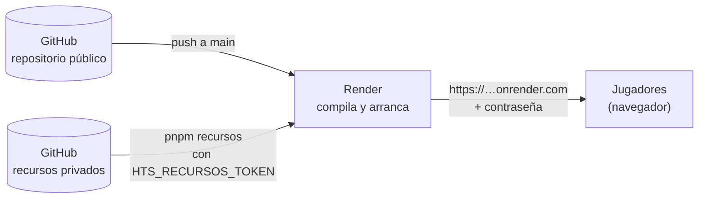

# Desplegar el servidor en la nube (Render)

**Resumen.** Esta guía explica, paso a paso y sin experiencia previa, cómo dejar el servidor en
línea en [Render](https://render.com) (plan **gratuito**) para que tus amigos jueguen siempre por
la misma dirección, sin depender de tu red ni de un túnel. Se protege con una **contraseña de
acceso** (`CLAVE_ACCESO`), porque la web incluye el arte y los textos oficiales de las cartas.
Para jugar desde tu propio equipo, mira [EN_LINEA.md](EN_LINEA.md); el detalle técnico del
servidor está en [SERVIDOR_Y_PROTOCOLO.md](SERVIDOR_Y_PROTOCOLO.md).

## 1. Qué se despliega y por qué la contraseña

Se despliega el mismo servidor de `pnpm servidor` (`apps/server`: Fastify + Socket.IO), que además
sirve la web compilada (`apps/web/dist`). Render lo compila y lo ejecuta en cada despliegue.

- **El código es público**, pero **las cartas no**: `Referencias/` y `assets/cartas/` (arte y
  textos oficiales) no están en el repositorio. Viven en un repositorio **privado**
  (`dbermudeza/here-to-slay-recursos`) y Render las descarga en cada compilación con
  `pnpm recursos`, usando un token de GitHub de solo lectura (`HTS_RECURSOS_TOKEN`).
- Como el servidor ya tiene esas cartas, serviría arte y textos oficiales a cualquiera que conozca
  la dirección. Por eso, en la nube se activa `CLAVE_ACCESO`: toda la web, la API, las imágenes y
  la conexión en tiempo real exigen haber entrado antes por la página `/acceso`.

El archivo [`render.yaml`](../render.yaml) de la raíz (un _Blueprint_ de Render) describe el
servicio, para que no tengas que configurarlo a mano:

| Campo en `render.yaml`    | Valor                                                                                            |
| ------------------------- | ------------------------------------------------------------------------------------------------ |
| `type`, `runtime`, `plan` | Servicio web (`web`) de Node, plan `free`.                                                       |
| `name`                    | `here-to-slay` (da la dirección `https://here-to-slay.onrender.com`).                            |
| `region`                  | `virginia` (ver [cómo cambiarla](#cambiar-el-nombre-o-la-región)).                               |
| `branch` y `autoDeploy`   | `main` y `true`: cada `push` a `main` redespliega.                                               |
| `buildCommand`            | `corepack enable && pnpm install --frozen-lockfile --prod=false && pnpm recursos && pnpm build`. |
| `startCommand`            | `pnpm --filter @hts/server start`.                                                               |
| `healthCheckPath`         | `/salud` (ruta pública; Render la consulta para saber si el servicio vive).                      |
| `NODE_VERSION`            | `24` (la misma que `.nvmrc`).                                                                    |
| `CLAVE_ACCESO`            | Secreta (`sync: false`): Render la pide al crear el servicio.                                    |
| `HTS_RECURSOS_TOKEN`      | Secreta (`sync: false`): Render la pide al crear el servicio.                                    |

Si el nombre `here-to-slay` ya lo usa otra cuenta, la dirección puede llevar un sufijo; Render
muestra la definitiva al crear el servicio.

### Cambiar el nombre o la región

Edita `name:` o `region:` en [`render.yaml`](../render.yaml), haz commit y `push` a `main`. Las
regiones válidas son `oregon`, `ohio`, `virginia`, `frankfurt` y `singapore`; elige la más cercana
a los jugadores. Pero **Render no mueve un servicio ya creado**: cambiar la región o el nombre en el
archivo no afecta al servicio existente. Para cambiar la región hay que borrar el servicio
(**Settings** → **Delete Service**) y crearlo de nuevo con el Blueprint, y habrá que volver a
introducir las dos variables secretas. Cambiar el nombre también cambia la dirección: avisa a tus
amigos.

`--prod=false` instala también las dependencias de desarrollo, entre ellas `tsx`, con el que
arranca el servidor (`startCommand`). Por eso **no pongas `NODE_ENV=production`** en las variables
de entorno: haría que `pnpm install` omitiera esas dependencias. Si lo pusieras, el `--prod=false`
del comando de compilación ya lo tiene cubierto, pero lo más sencillo es no definirla.

El puerto no hace falta configurarlo: Render define `PORT` y el servidor lo lee (lee `PUERTO` y,
si no existe, `PORT`).

**Comprobado en local.** Se ha ensayado todo el recorrido en una copia limpia del repositorio:
`pnpm install --frozen-lockfile`, `pnpm recursos` con `HTS_RECURSOS_TOKEN` y `pnpm build`; arranque
con `PORT` y `CLAVE_ACCESO`; `/salud` público; redirección a `/acceso` conservando `?sala=`;
imágenes con 401 sin cookie y 200 con ella; Socket.IO con 403 sin cookie y 200 con ella; y el token
no aparece en la salida. Lo que no se puede ensayar en local es el comportamiento propio de Render
(suspensión, regiones, límites).

## 2. Límites del plan gratuito

Conviene saberlo antes de invitar a nadie:

- **Se duerme** tras unos 15 minutos sin tráfico.
- **La primera visita tras dormirse tarda alrededor de 1 minuto** en despertarlo. Avisa a tus
  amigos de que esperen y recarguen la página si ven un error de pasarela.
- **Se pierden las salas al dormirse** (y en cada redespliegue o reinicio): las salas y las
  partidas viven en la memoria del servidor. Una partida a medias no sobrevive a un reinicio.
  Mientras haya jugadores conectados se mantiene despierto.
- **Horas al mes limitadas** en el plan gratuito: si se agotan, Render suspende el servicio hasta
  el mes siguiente. Consulta las cifras vigentes en la página de precios de Render, porque cambian.

**Pasar a un plan de pago.** En el panel de Render, abre el servicio, entra en _Settings_ →
_Instance Type_ y elige un plan de pago. Qué cambia: el servicio **deja de dormirse** (no hay
espera de 1 minuto) y no hay tope de horas gratuitas. Las salas **siguen en memoria**: se pierden
al redesplegar o reiniciar, y no hay base de datos que cambiar. Si editas `render.yaml` para poner
otro `plan:`, hazlo con un commit y Render lo aplicará al sincronizar el Blueprint.

## 3. Crear el token de GitHub (para las cartas)

El token permite a Render leer el repositorio privado de recursos. Debe tener los mínimos permisos.

1. En GitHub: foto de perfil → **Settings** → **Developer settings** → **Personal access tokens** →
   **Fine-grained tokens** → **Generate new token**.
2. **Token name**: por ejemplo `render-hts-recursos`.
3. **Expiration**: elige una fecha de caducidad (p. ej. 90 días). Apunta cuándo caduca: pasado ese
   día las compilaciones fallarán hasta que lo renueves (ver [§8](#8-rotar-la-contraseña-y-el-token)).
4. **Repository access**: _Only select repositories_ y elige **solo** `here-to-slay-recursos`.
5. **Permissions** → _Repository permissions_ → **Contents: Read-only**. No des ningún otro permiso.
6. Pulsa **Generate token** y **cópialo ya**: GitHub no lo vuelve a mostrar.

Ese valor se pega después en Render como `HTS_RECURSOS_TOKEN` (paso 4). No lo guardes en el
repositorio, en un archivo `.env` versionado, en capturas ni en chats.

Vale también un token **clásico** con el permiso `repo`, pero da mucho más acceso del necesario:
prefiere el de grano fino.

### Cómo usa el token `pnpm recursos`

Lo mismo sirve para descargar los recursos en cualquier equipo sin sesión de Git (un servidor, un
contenedor…): define `HTS_RECURSOS_TOKEN` y ejecuta `pnpm recursos`.
Código: [`packages/cards/src/recursos-git.ts`](../packages/cards/src/recursos-git.ts) y
[`packages/cards/src/scripts/recursos.ts`](../packages/cards/src/scripts/recursos.ts).

- El token viaja en una **cabecera HTTP** que se pasa a Git por el entorno (`GIT_CONFIG_COUNT`,
  `GIT_CONFIG_KEY_n`, `GIT_CONFIG_VALUE_n`), **nunca en la URL ni en los argumentos** del comando
  (que otros procesos podrían ver).
- La salida se limpia: el token y la cabecera se ocultan, y las URL con credenciales se muestran
  como `https://***@…`.
- Con token, el repositorio (`HTS_RECURSOS_REPO` o `--repo`) debe ser una URL `https://`; con otra
  da error.
- Se fija `GIT_TERMINAL_PROMPT=0`: si el acceso falla, Git **falla** en vez de quedarse esperando
  un usuario y una contraseña.
- Necesita **Git ≥ 2.31** (por las variables `GIT_CONFIG_*`). El entorno de compilación de Render
  lo cumple.

## 4. Crear la cuenta en Render y desplegar

1. Entra en <https://render.com> y regístrate con **GitHub** («Sign in with GitHub»), lo que
   conecta ya tu cuenta. Si te registras con correo, conecta GitHub luego desde _Account Settings_.
2. Autoriza a Render a ver el repositorio público del proyecto (puedes limitarlo solo a ese).
3. En el panel: **New +** → **Blueprint**. Elige el repositorio del proyecto y la rama `main`.
   Render lee `render.yaml` y muestra el servicio que creará.
4. Render te pide los valores de las variables marcadas `sync: false`:
   - `CLAVE_ACCESO`: la contraseña que compartirás con tus amigos. Elige una **larga** y no la
     reutilices (por ejemplo, 4 o 5 palabras al azar; ver [§9](#9-seguridad)). En esta guía la llamamos `<tu-contraseña>`.
   - `HTS_RECURSOS_TOKEN`: el token del paso 3.
5. Pulsa **Apply** (o _Deploy Blueprint_). Render empieza a compilar; tarda unos minutos. Puedes ver
   el avance en la pestaña **Logs** del servicio.
6. Al terminar, el servicio queda en estado **Live** y Render muestra su dirección fija, del tipo
   `https://<nombre-del-servicio>.onrender.com`.

## 5. Primera comprobación y cómo invitar

1. Abre `https://<nombre-del-servicio>.onrender.com/salud`. Debe responder sin pedir contraseña
   (es la ruta pública del chequeo). Si es la primera visita, espera hasta 1 minuto.
2. Abre la raíz `https://<nombre-del-servicio>.onrender.com/`. Te llevará a **`/acceso`**: escribe
   `<tu-contraseña>`. El navegador guarda una _cookie_ durante **30 días**, así que no tendrás que
   repetirlo en ese tiempo.
3. Comprueba que se ven las cartas (si salen sin imagen o sale «Faltan las cartas», revisa el token;
   ver [§7](#7-registros-y-problemas-habituales)).
4. Pulsa **Jugar en línea → Crear sala**. Con la dirección fija no necesitas el túnel de Cloudflare.

**Invitar.** Envía a cada amigo, por un canal privado:

- el **enlace de invitación** (el de «Invitar a jugar», que acaba en `?sala=CÓDIGO`), y
- la **contraseña** `<tu-contraseña>`, **en un mensaje aparte** del enlace.

Al abrir el enlace, la web les pide la contraseña y, una vez dentro, les lleva directamente a la
sala. A partir de ahí, la partida funciona como se describe en [EN_LINEA.md](EN_LINEA.md#4-durante-la-partida).
Recuerda que una sala solo existe mientras el servidor esté despierto.

## 6. Actualizar tras cambios

- **Automático.** Render redespliega cada vez que haces `push` a `main` (auto-deploy). La compilación
  vuelve a descargar los recursos privados.
- **A mano.** En el panel de Render, abre el servicio → **Manual Deploy** → **Deploy latest commit**
  (o _Clear build cache & deploy_ si algo quedó a medias).
- **Cuando cambien las cartas** (cambia el repositorio de recursos): hace falta **redesplegar a
  mano**, porque los recursos se descargan en cada compilación y un `push` a ese repositorio privado
  no avisa a Render.
- Cada redespliegue **reinicia el servidor y borra las salas en curso**: no actualices en mitad de
  una partida.

## 7. Registros y problemas habituales

Los **registros** están en el panel de Render → tu servicio → **Logs** (compilación y ejecución).
El token no debe aparecer en ellos: `pnpm recursos` clona sin ponerlo en la URL ni en la salida. Si
alguna vez lo ves escrito, revócalo y crea otro.

| Síntoma                                                                                                      | Causa probable y solución                                                                                                                                                                                                                                                                                             |
| ------------------------------------------------------------------------------------------------------------ | --------------------------------------------------------------------------------------------------------------------------------------------------------------------------------------------------------------------------------------------------------------------------------------------------------------------- |
| La compilación falla en `pnpm recursos`                                                                      | Falta `HTS_RECURSOS_TOKEN`, ha caducado, está mal copiado o no tiene acceso a `here-to-slay-recursos`. Crea otro (§3) y actualízalo (§8).                                                                                                                                                                             |
| La compilación falla en `pnpm recursos` con «No se pudieron descargar los recursos con `HTS_RECURSOS_TOKEN`» | El mensaje lista tres causas: el token **caducó o se revocó**; **no tiene permiso** de lectura (debe ser «Contents: Read-only» sobre `here-to-slay-recursos`); o el repositorio no es el esperado. Crea otro token (§3) y actualízalo (§8). Si el error habla de una URL, recuerda que con token debe ser `https://`. |
| La compilación falla al instalar o con un error de versión de Node                                           | Render usó otra versión de Node. Comprueba que `NODE_VERSION` vale `24` en _Environment_ (es la de `.nvmrc`; el proyecto exige Node ≥ 20.12) y redespliega con _Clear build cache & deploy_.                                                                                                                          |
| Compila, pero la web dice «Faltan las cartas»                                                                | Los recursos no se instalaron: mira los registros de la compilación. Redespliega tras arreglar el token.                                                                                                                                                                                                              |
| Error `401` en la web, las imágenes o la API                                                                 | No has entrado por `/acceso` o la cookie caducó o se borró: abre la raíz e introduce `<tu-contraseña>`. Si cambiaste `CLAVE_ACCESO`, hay que volver a entrar.                                                                                                                                                         |
| Responde «Demasiados intentos» (429)                                                                         | Hubo muchos fallos (10 desde tu IP o 50 en total en 10 minutos): las entradas **nuevas** quedan bloqueadas. Espera 10 minutos y vuelve a probar con la contraseña correcta. Las sesiones ya abiertas no se ven afectadas.                                                                                             |
| La contraseña «no funciona»                                                                                  | Revisa mayúsculas y espacios, y que coincida con el valor de `CLAVE_ACCESO` en Render (_Environment_).                                                                                                                                                                                                                |
| Entras pero no se conecta a la sala (se queda cargando)                                                      | La conexión en tiempo real (Socket.IO) también exige la cookie: entra primero por `/acceso` en ese mismo navegador. Prueba a recargar. En el navegador, bloquear cookies de terceros o la navegación privada estricta puede impedirlo.                                                                                |
| Tarda un minuto o da error de pasarela (502/503) la primera vez                                              | El servicio estaba dormido (plan gratuito). Espera hasta 1 minuto y recarga.                                                                                                                                                                                                                                          |
| Las salas desaparecieron                                                                                     | El servicio se durmió, se reinició o se redesplegó: viven en memoria. Crea otra.                                                                                                                                                                                                                                      |
| Render marca el servicio como no saludable                                                                   | El chequeo es `/salud`; mira los registros de ejecución por si el servidor no arrancó (p. ej. faltan las cartas).                                                                                                                                                                                                     |
| El servicio está «Suspended»                                                                                 | Agotaste las horas gratuitas del mes: espera al siguiente o pasa a un plan de pago (§2).                                                                                                                                                                                                                              |

**Pausar o borrar.** En el panel del servicio: **Settings** → **Suspend Service** lo detiene sin
perder la configuración (se reanuda con _Resume_); **Delete Service** lo elimina del todo (la
dirección deja de existir). Si borras el servicio, revoca también el token en GitHub.

## 8. Rotar la contraseña y el token

- **Cambiar la contraseña** (`CLAVE_ACCESO`): en Render → servicio → **Environment** → edita
  `CLAVE_ACCESO` → _Save_. Render reinicia el servicio. La cookie se firma con una clave derivada
  de ese valor, así que **todas las sesiones abiertas dejan de valer** y quienes ya habían entrado
  deberán volver a introducir la nueva. Hazlo siempre que alguien que no
  deba la sepa. Comunica la nueva por un canal privado.
- **Renovar el token** (`HTS_RECURSOS_TOKEN`): crea otro token como en el paso 3, pégalo en
  **Environment** → `HTS_RECURSOS_TOKEN`, redespliega, y cuando el despliegue funcione, **borra el
  token viejo** en GitHub (_Developer settings_ → _Fine-grained tokens_ → _Delete_). Ponte un aviso
  antes de su fecha de caducidad.

## 9. Seguridad

- **No compartas el token** de GitHub con nadie ni lo pegues en el repositorio, en incidencias, en
  chats o en capturas. Solo debe estar en el campo secreto de Render.
- **Envía la contraseña por un canal privado** (mensaje directo), no en un grupo público ni en
  redes sociales, y mejor en un mensaje distinto al del enlace.
- **Qué protege la contraseña:** el acceso a la web, a la API, a las imágenes y a la conexión en
  tiempo real. Sin haber entrado, no se ve el arte ni los textos de las cartas. La cookie es
  `HttpOnly` (los scripts de la página no pueden leerla), va firmada (HMAC con una clave derivada
  de la contraseña mediante `scrypt`, así que una cookie filtrada no permite adivinar la contraseña
  sin conexión) y **caduca a los 30 días en el servidor**, aunque el navegador la conserve. Todas las
  respuestas llevan `Cache-Control: private`, para que ninguna caché compartida guarde el arte, y la
  página `/acceso` no se puede incrustar en otra web.
- **Elige una contraseña larga** (por ejemplo, 4 o 5 palabras al azar). Hay un límite de intentos:
  10 fallos por IP cada 10 minutos y un **tope total de 50 fallos cada 10 minutos**, porque detrás
  del proxy de Render la IP sale de `X-Forwarded-For`, que un atacante puede inventar (el límite
  por IP solo no bastaría). La consecuencia es que alguien que pruebe muchas contraseñas puede
  **bloquear durante 10 minutos las entradas nuevas de todos** (verán «Demasiados intentos»); las
  sesiones ya abiertas siguen funcionando. Con una contraseña larga, adivinarla es inviable aun con
  ese margen de intentos.
- **Qué no protege:** quien conozca la contraseña ve todas las cartas (si se la pasa a otro, ese
  otro también); no distingue usuarios ni los revoca uno a uno (para echar a alguien, cambia la
  contraseña); y no impide que un invitado haga capturas. `/salud` es pública a propósito y solo
  indica que el servicio está vivo.
- **HTTPS:** Render sirve la dirección `onrender.com` con HTTPS, así que la contraseña no viaja en
  claro.
- Usa el servicio solo con amigos y no publiques la dirección ni la contraseña.

## Para desarrolladores

- La protección y la lectura de `PORT` están descritas en
  [SERVIDOR_Y_PROTOCOLO.md](SERVIDOR_Y_PROTOCOLO.md#protección-por-contraseña).
- El token de `pnpm recursos` es `HTS_RECURSOS_TOKEN`; `HTS_RECURSOS_REPO` cambia el repositorio
  (ver el [README](../README.md#recursos-de-las-cartas)).
- Si cambias la versión de Node o los comandos de compilación, actualiza `render.yaml` (y `.nvmrc`)
  y esta guía.
