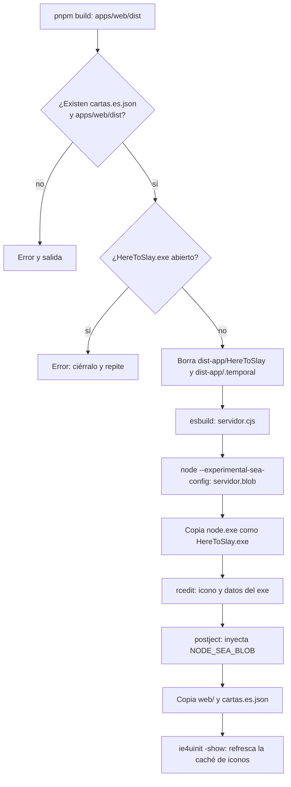
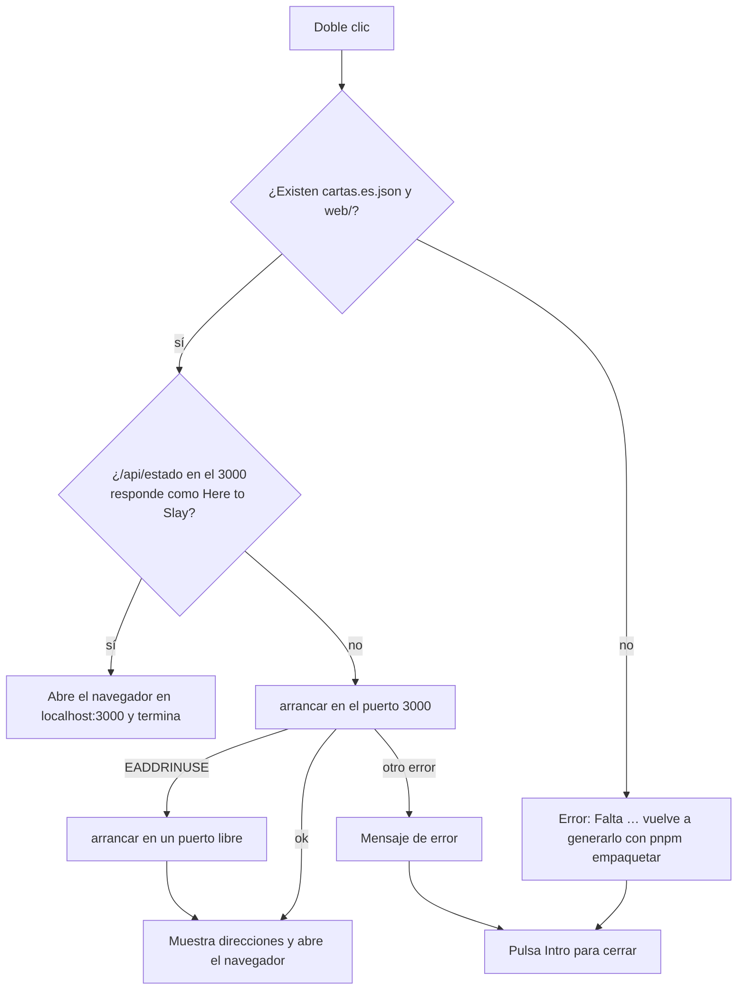

# Ejecutable de escritorio (`HereToSlay.exe`)

**Resumen.** `pnpm empaquetar` genera la carpeta `dist-app/HereToSlay/`, con la que se puede jugar
sin Node ni pnpm: un doble clic en `HereToSlay.exe` arranca el [servidor en línea](SERVIDOR_Y_PROTOCOLO.md)
en el puerto 3000 y abre el navegador. Sirve tanto para jugar en este equipo (local o contra bots)
como para hacer de servidor de una partida en línea ([EN_LINEA.md](EN_LINEA.md)). El ejecutable es
el propio Node con el código del servidor dentro (_Single Executable Application_, SEA); la web y
las cartas van en archivos junto a él.

Código: `apps/server/scripts/empaquetar.ts` (empaquetado), `apps/server/scripts/icono.ts` (icono),
`apps/server/src/principal-escritorio.ts` y `apps/server/src/escritorio.ts` (arranque). Tests:
`apps/server/test/escritorio.test.ts` e `icono.test.ts`.

## Requisitos

- Haber instalado los recursos (`pnpm recursos`): sin `Referencias/cartas.es.json` no se puede
  empaquetar.
- Node ≥ 20.12 (el de `engines` en `package.json`). El ejecutable copia **el Node con el que se
  ejecuta el script**, así que lleva esa versión.
- Pensado para Windows. En macOS y Linux el script genera `HereToSlay` (sin `.exe`, y en macOS con el
  segmento `NODE_SEA`), pero sin icono ni los pasos propios de Windows.

## Qué hace `pnpm empaquetar`

El script raíz es `pnpm build && pnpm --filter @hts/server empaquetar`: primero compila la web
(`apps/web/dist`) y después ejecuta `apps/server/scripts/empaquetar.ts`.



Paso a paso:

1. **Comprobaciones.** Que existan `Referencias/cartas.es.json` ("instálalo con pnpm recursos") y
   `apps/web/dist` ("compílala con pnpm build").
2. **Protección con el exe abierto.** Intenta abrir `HereToSlay.exe` en escritura (`openSync(…,
'r+')`). Si está en marcha, Windows no deja hacerlo y el script se detiene **antes de borrar
   nada**: Windows no deja borrar un ejecutable abierto, pero sí los archivos de su lado, así que sin
   esta comprobación se borraría parte de `web/` y el servidor en marcha dejaría de servir imágenes.
3. **Limpieza.** Borra y vuelve a crear `dist-app/HereToSlay/` y la carpeta de trabajo
   `dist-app/.temporal/`.
4. **esbuild.** Empaqueta `src/principal-escritorio.ts` y todas sus dependencias (motor, cartas,
   bots, anfitrión, Fastify, Socket.IO…) en **un único archivo CommonJS** minificado
   (`servidor.cjs`), con `platform: 'node'` y como objetivo la versión mayor del Node actual. SEA
   solo admite un script CommonJS.
5. **Blob SEA.** Escribe `sea-config.json` (`main`, `output`, `disableExperimentalSEAWarning`) y
   ejecuta `node --experimental-sea-config`, que produce `servidor.blob`.
6. **Copia de Node.** Copia el ejecutable de Node actual (`process.execPath`) como
   `HereToSlay.exe`.
7. **Icono (solo Windows).** Antes de inyectar el código, porque `rcedit` reescribe los recursos del
   ejecutable:
   - Lee el logo de la web compilada (`apps/web/dist/cartas/logo.png`, `IMAGEN_LOGO` de
     `@hts/cards`).
   - `iconoDesdeLogo` (`scripts/icono.ts`) genera un PNG de 256 × 256 (`LADO_ICONO`): recorta el
     margen transparente del logo (`cajaVisible`), lo escala con interpolación bilineal y
     supermuestreo 3 × 3, y lo coloca sobre un cuadrado redondeado oscuro (el `stone-900` de la web),
     con el borde suavizado. Hace falta porque el logo es texto claro sobre fondo transparente con
     mucho margen: como icono apenas se vería. La imagen original no se modifica.
   - `png-to-ico` lo convierte en `logo.ico` (con los tamaños menores derivados).
   - `rcedit` pone el icono y los datos `ProductName`/`FileDescription` ("Here to Slay"). Sin logo
     (recursos no instalados), avisa y deja el icono de Node.
8. **postject.** Inyecta `servidor.blob` como recurso `NODE_SEA_BLOB` en el ejecutable y activa el
   fusible de SEA (`NODE_SEA_FUSE_…`), que es lo que hace que Node arranque ese código en lugar de
   comportarse como `node`.
9. **Archivos de al lado.** Copia `apps/web/dist` como `web/` y `Referencias/cartas.es.json` como
   `cartas.es.json`. Borra `dist-app/.temporal/`.
10. **Caché de iconos (solo Windows).** Ejecuta `ie4uinit.exe -show` para que el Explorador
    olvide el icono anterior. Si falla, solo avisa: el icono nuevo puede tardar en verse.

## Qué contiene `dist-app/HereToSlay/`

```
dist-app/HereToSlay/
├── HereToSlay.exe     Node + el servidor (SEA), con el icono del juego
├── web/               la aplicación web compilada; las imágenes, en web/cartas/
└── cartas.es.json     los datos de las cartas
```

La carpeta se puede mover o copiar entera a otro equipo con Windows (las tres piezas deben ir
juntas). **No se versiona** (`dist-app/` está en `.gitignore`): contiene el arte y los textos
oficiales de las cartas, que son personales y no pueden ir al repositorio público, y además pesa
bastante (incluye un Node completo). Se regenera con `pnpm empaquetar`.

## Qué hace el exe al arrancar

`principal-escritorio.ts` decide dónde están los archivos: si se ejecuta como SEA (`isSea()` de
`node:sea`), junto al ejecutable (`rutasEscritorio(dirname(process.execPath))`); si se ejecuta con
`tsx` en el repositorio, los del repositorio (`Referencias/cartas.es.json` y `apps/web/dist`).
Después llama a `principal(rutas)` (`escritorio.ts`):



- **Ya en marcha:** `estaEnMarcha(3000)` pide `http://127.0.0.1:3000/api/estado` (espera máxima de
  1,5 s) y solo lo da por bueno si la respuesta es JSON con un campo `salas`. Así no confunde otro
  programa con Here to Slay. Si ya hay uno, solo abre el navegador; la ventana nueva se cierra.
- **Puerto ocupado por otro programa:** si escuchar en el 3000 falla con `EADDRINUSE`, arranca en el
  puerto `0` (el sistema elige uno libre). La consola muestra el puerto elegido. Ojo: un segundo doble
  clic no encontrará ese servidor (solo comprueba el 3000) y arrancará otro.
- **Navegador:** `abrirNavegador(url)` usa `rundll32 url.dll,FileProtocolHandler` en Windows (`open`
  en macOS, `xdg-open` en Linux). Si falla, escribe la dirección en la consola.
- **Consola:** queda abierta con las direcciones (`mostrarDirecciones`: este equipo y la red local).
  **Cerrar la ventana detiene el servidor**; Ctrl+C también (`apagarAlSalir`).
- **Errores:** cualquier error de arranque se muestra como "No se pudo arrancar Here to Slay: …" y la
  ventana espera a que se pulse Intro (`esperarIntro`), para que se pueda leer antes de cerrarse.
- El exe usa siempre las opciones por defecto del anfitrión: **no** lee `PUERTO`, `DIR_WEB` ni las
  variables de milisegundos de `pnpm servidor`. Sí lee `CLOUDFLARED` (al abrir el túnel).

## Problemas habituales

| Problema                                               | Causa y solución                                                                                                                                                                              |
| ------------------------------------------------------ | --------------------------------------------------------------------------------------------------------------------------------------------------------------------------------------------- |
| "Windows protegió su PC" (SmartScreen) al abrirlo      | El ejecutable no está firmado. Pulsa **Más información → Ejecutar de todas formas**. Suele salir la primera vez que se abre (y tras regenerarlo).                                             |
| Aviso del cortafuegos                                  | El servidor escucha en toda la red local. Permite el acceso en **redes privadas** para que entren los de tu Wi-Fi; para jugar solo en este equipo no hace falta.                              |
| Sigue saliendo el icono de Node o el antiguo           | La caché de iconos del Explorador. `pnpm empaquetar` la refresca con `ie4uinit -show`; si no basta, cierra sesión o reinicia el Explorador. Sin `pnpm recursos` no hay logo: sale el de Node. |
| `HereToSlay.exe está abierto: ciérralo…` al empaquetar | Cierra la ventana del servidor y vuelve a ejecutar `pnpm empaquetar`.                                                                                                                         |
| Abre en un puerto distinto del 3000                    | Otro programa ocupa el 3000. Mira el puerto en la consola, o cierra ese programa. Para invitar, comparte la dirección que muestra la consola.                                                 |
| `Falta …\cartas.es.json` o `…\web`                     | La carpeta está incompleta (se copió solo el exe). Copia la carpeta entera o vuelve a ejecutar `pnpm empaquetar`.                                                                             |
| `Falta …: instálalo con pnpm recursos` al empaquetar   | Faltan los recursos personales: `pnpm recursos` (ver el `README.md`).                                                                                                                         |

Para el resto (jugar por internet, túnel de Cloudflare, invitar) ver [EN_LINEA.md](EN_LINEA.md).
