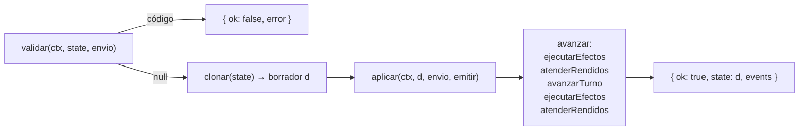
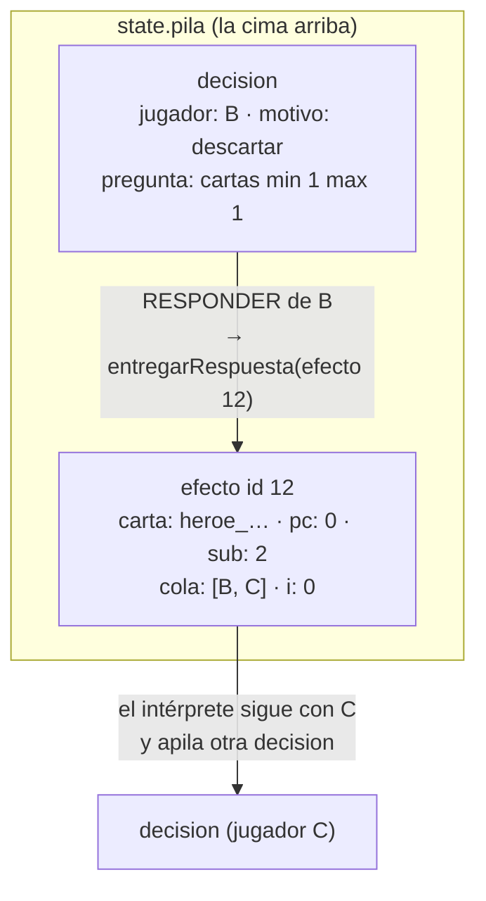
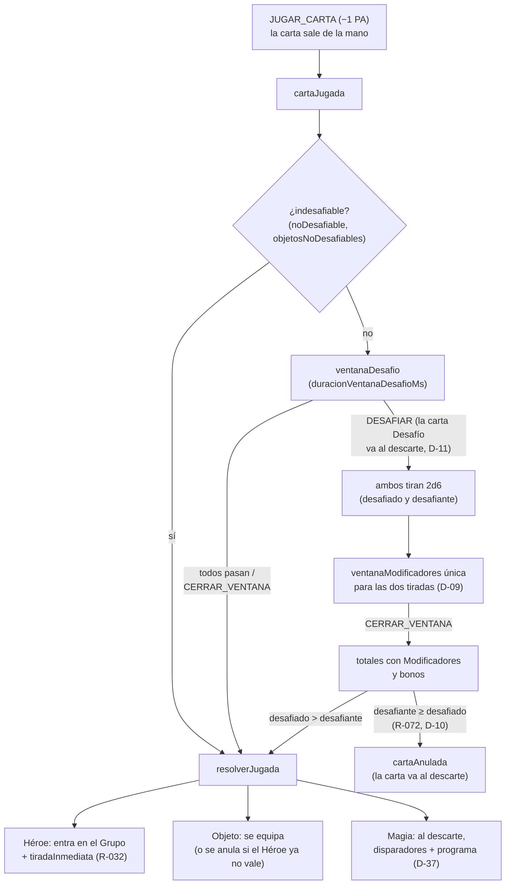

# Motor de reglas (`packages/engine`)

`@hts/engine` implementa las reglas de _Here to Slay_ como una función pura:
`reducer(estado, { actor, accion })` → `{ ok, state, events }`. No tiene E/S, ni temporizadores, ni
aleatoriedad externa: el RNG con semilla vive dentro del estado. Las decisiones pendientes forman
una pila; los efectos de carta se interpretan desde un DSL
([CARTAS_Y_EFECTOS.md](CARTAS_Y_EFECTOS.md)). Cada jugador ve una versión filtrada del estado
(`getPlayerView`).

Visión general del sistema en [ARQUITECTURA.md](ARQUITECTURA.md); reglas en [REGLAS.md](REGLAS.md)
y ambigüedades en [DUDAS_REGLAS.md](DUDAS_REGLAS.md).

## Mapa de archivos

| Archivo         | Contenido                                                                  |
| --------------- | -------------------------------------------------------------------------- |
| `index.ts`      | API pública del paquete                                                    |
| `motor.ts`      | `crearMotor`, `reducir` (validar → clonar → aplicar → avanzar)             |
| `tipos.ts`      | `GameState`, `Accion`, `Evento`, `Pendiente`, `CodigoError`…               |
| `crear.ts`      | Preparación de la partida (`crearPartida`)                                 |
| `validar.ts`    | `validar`: por qué una acción es ilegal                                    |
| `legales.ts`    | `accionesLegales`, `respuestasPosibles`                                    |
| `aplicar.ts`    | `aplicar`: efecto de cada acción ya validada                               |
| `flujo.ts`      | Jugadas, ventanas, tiradas, Monstruos, fin de turno                        |
| `ops.ts`        | Operaciones básicas: barajar, dado, robar, descartar, abrir ventana        |
| `grupo.ts`      | ROBAR con disparadores, SACRIFICAR, DESTRUIR, ARREBATAR, mover Héroes      |
| `pasivas.ts`    | Pasivas activas, bonos de tirada, restricciones, reemplazos, disparadores  |
| `interprete.ts` | Intérprete del DSL de efectos                                              |
| `customs.ts`    | Pasos `custom` en TypeScript                                               |
| `marcos.ts`     | `apilarMarco`: apila un efecto en ejecución                                |
| `efectos.ts`    | Tipos `Ctx`, `EntornoPaso`, `ManejadorCustom`                              |
| `consultas.ts`  | Consultas sin efectos: cartas, jugadores, clases, requisitos, conservación |
| `victoria.ts`   | Condiciones de victoria                                                    |
| `rendicion.ts`  | Rendirse (D-43) y respuestas automáticas por los rendidos                  |
| `vista.ts`      | `getPlayerView`, `eventoParaJugador`                                       |
| `serializar.ts` | Guardar y cargar partidas                                                  |
| `log.ts`        | `describirEvento`: historial en español                                    |
| `rng.ts`        | Generador sfc32 con semilla                                                |

## API

```ts
import { crearMotor, SISTEMA } from '@hts/engine';

const motor = crearMotor(cartas); // cartas: Carta[] de cartas.es.json
const { state, events } = motor.crearPartida({
  jugadores: [
    { id: 'ana', nombre: 'Ana' },
    { id: 'beto', nombre: 'Beto' },
  ],
  semilla: 'cualquier-texto',
  opciones: { modo: 'normal' },
});
const r = motor.reducer(state, { actor: state.turno.jugador, accion: { tipo: 'ROBAR' } });
if (r.ok) {
  // r.state es un estado nuevo; `state` no ha cambiado. r.events describe lo ocurrido.
} else {
  // r.error.codigo: CodigoError
}
```

- `crearMotor(cartas, { definiciones?, custom? })`: crea el motor. `definiciones` sustituye a
  `DEFINICIONES_EFECTOS` y `custom` añade pasos a `CUSTOM_POR_DEFECTO`.
- `motor.crearPartida(config)`: prepara una partida; lanza `ErrorConfiguracion` si no vale.
- `motor.reducer(state, envio)`: valida y aplica una acción. Nunca muta `state`.
- `motor.validar(state, envio)`: `CodigoError` de una acción ilegal, o `null`.
- `motor.accionesLegales(state, actor)`: acciones legales de `actor` (sin `RENDIRSE`).
- `motor.getPlayerView(state, jugador)`: vista filtrada (`jugador = null`: espectador).
- `motor.serializar(state)` / `motor.cargar(texto)`: guardar y cargar; `cargar` lanza `ErrorCarga`.
- `motor.catalogo`: `Map` id → `Carta`.
- `describirEvento(evento, nombres)`: texto del historial, o `null` si el evento no le interesa.
- `eventoParaJugador(evento, yo)`: versión de un evento que puede recibir `yo`.

`index.ts` exporta además utilidades para la interfaz y los bots: `respuestasPosibles`,
`clasesDelGrupo`, `desgloseClases`, `cumpleRequisitos`, `totalTirada`, `bonosDeTirada`,
`problemaDeConservacion`, `PA_POR_TURNO`, `crearRng`/`siguienteRng`, `MIN_JUGADORES`/`MAX_JUGADORES`
y `CUSTOM_POR_DEFECTO`.

### Qué hace `reducer` por dentro (`motor.ts`)



- `aplicar` cambia el borrador según la acción (cobra PA, mueve cartas, apila ventanas…).
- `ejecutarEfectos` ejecuta los marcos de efecto de la cima hasta que uno espera una decisión o una
  ventana, o no queda ninguno.
- `atenderRendidos` responde por los jugadores rendidos (D-43).
- `avanzarTurno` termina el turno solo si no queda nada en la pila y no quedan PA (R-026).
- La segunda pasada de efectos existe porque el robo gratis al empezar el turno (R-029) puede
  activar disparadores (Malamamut, Orthus…).

Un `ErrorInterno` (`consultas.ts`) indica un fallo del propio motor (una invariante rota), no una
acción ilegal: las acciones ilegales siempre se rechazan antes, en `validar`.

## `GameState`

Definido en `tipos.ts`. Es JSON puro (se clona con `JSON.parse(JSON.stringify())`).

| Campo             | Qué guarda                                                                 |
| ----------------- | -------------------------------------------------------------------------- |
| `version`         | Siempre `1` (formato del estado)                                           |
| `opciones`        | `modo` (`normal`/`dificil`), duraciones de las ventanas (ms) y `bots`      |
| `rng`             | Estado del generador (4 enteros de 32 bits)                                |
| `secuencia`       | Cambia cada vez que una ventana se abre o se reinicia                      |
| `siguienteEfecto` | Siguiente id de marco de efecto                                            |
| `instancias`      | `uid` → id de catálogo de cada copia en juego                              |
| `jugadores`       | En orden de asiento: `id`, `nombre`, `lider`, `mano`, `grupo`, `monstruos` |
| `mazo`            | Mazo principal; la carta superior es el índice 0                           |
| `descarte`        | Descarte (público); la carta superior es la última                         |
| `mazoMonstruos`   | Mazo de Monstruos boca abajo                                               |
| `monstruosCentro` | Monstruos boca arriba que se pueden ATACAR                                 |
| `turno`           | `jugador`, `numero`, `pa`, `paInicial`, `heroesUsados`…                    |
| `pila`            | Pendientes; la cima es el último elemento                                  |
| `temporales`      | Efectos con duración (bono de tirada, protecciones)                        |
| `ganador`         | `{ jugador, motivo }` o `null`                                             |
| `rendidos`        | Jugadores que se han rendido (D-43)                                        |
| `dadosForzados`   | Solo tests: dados que se usan antes que el RNG (nunca se envía)            |

**Uids.** Cada copia física de una carta tiene un uid `<idCarta>#<n>` (p. ej. `desafio#7`). Las
cartas se mueven entre listas por uid; `instancias` traduce el uid a la carta del catálogo.
`problemaDeConservacion` (`consultas.ts`) comprueba que ningún uid se pierda ni se duplique; lo usan
los tests de propiedades, la simulación de 1.000 partidas y `cargar`.

**Ranura.** Un Héroe del Grupo con su Objeto (`{ heroe, objeto }`, como mucho un Objeto: R-043).

### Preparación (`crear.ts`, R-010..R-015)

1. De 2 a 6 jugadores (D-01) con ids únicos que no empiezan por `@` (reservado para `SISTEMA`).
2. Se crean las copias del mazo principal (`TIPOS_MAZO_PRINCIPAL`) y del mazo de Monstruos.
3. Con 2 jugadores no se usa el Líder de la clase ladrón (R-011).
4. Los Líderes se reparten al azar (D-02); empieza quien recibe el último (R-015).
5. Se baraja el mazo y se reparten 5 cartas a cada jugador (R-013); se ponen 3 Monstruos en el
   centro (R-014).
6. El primer jugador roba también su carta gratis de inicio de turno (R-029, D-42).

## El turno

No hay un campo "fase": el momento del turno se deduce de la pila.

- **Pila vacía**: el jugador del turno puede gastar PA en acciones de turno.
- **Pila con algo**: solo puede actuar quien indica la cima (ver más abajo).

| Acción           | Coste (PA) | Notas                                   |
| ---------------- | ---------- | --------------------------------------- |
| `ROBAR`          | 1          | Roba una carta (disparadores de robo)   |
| `JUGAR_CARTA`    | 1          | Héroe, Objeto (con `objetivo`) o Magia  |
| `TIRAR_HEROE`    | 1          | Una vez por Héroe y turno (R-034, D-05) |
| `ATACAR`         | 2          | Con los requisitos del Monstruo (R-086) |
| `RENOVAR_MANO`   | 3          | Descarta la mano y roba 5 (R-023)       |
| `USAR_HABILIDAD` | `costePa`  | Habilidad de Líder o Monstruo propio    |
| `FIN_TURNO`      | —          | Termina el turno aunque queden PA       |

- `PA_POR_TURNO = 3` (`ops.ts`). Al empezar el turno, `pa = 3 + paExtra` (pasiva `paExtra` de
  Megababosa, D-36) y `paInicial` guarda ese valor (solo informativo para la interfaz).
- **Fin de turno** (`finTurno`, `flujo.ts`): emite `turnoTerminado`, caducan los temporales
  `finTurno` del jugador, se comprueba la victoria por clases, se pasa al siguiente jugador no
  rendido en sentido horario, caducan sus temporales `inicioTurnoPropio`, se reinician los PA y roba
  una carta gratis (R-029, D-42).
- El turno termina solo cuando no quedan PA y no hay nada pendiente (`avanzarTurno`, R-026).

## La pila

`state.pila` es una lista de `Pendiente`. Solo puede actuar quien indica la cima; mientras haya
algo, las acciones de turno devuelven `HAY_DECISION_PENDIENTE`.

| Tipo                   | Quién actúa                   | Acepta                                |
| ---------------------- | ----------------------------- | ------------------------------------- |
| `ventanaDesafio`       | Rivales que no han pasado     | `DESAFIAR`, `PASAR`, `CERRAR_VENTANA` |
| `ventanaModificadores` | Cualquier jugador             | `JUGAR_MODIFICADOR`, `CERRAR_VENTANA` |
| `tiradaInmediata`      | Dueño del Héroe recién jugado | `TIRADA_INMEDIATA { tirar }`          |
| `elegir`               | El jugador penalizado         | `ELEGIR { uids }`                     |
| `efecto`               | Nadie (el intérprete)         | —                                     |
| `decision`             | `decision.jugador`            | `RESPONDER { respuesta }`             |

- La **ventana de desafío** se cierra cuando alguien desafía, cuando todos los rivales activos han
  pasado o cuando el host envía `CERRAR_VENTANA`.
- La **ventana de Modificadores** solo la cierra el host; cada Modificador reinicia la cuenta.
- `elegir` es la penalización de un Monstruo: SACRIFICAR o DESCARTAR `cantidad` cartas.
- Un `efecto` sale de la pila cuando su programa termina; una `decision`, cuando se responde.

`RENDIRSE` se acepta siempre que no haya ganador (de cualquier jugador no rendido) y
`CERRAR_VENTANA` solo del actor `SISTEMA` y con la `secuencia` de la ventana de la cima (si no,
`SECUENCIA_OBSOLETA`).

Un ejemplo de pila durante un efecto que hace elegir a un jugador, lanzado por un Héroe cuya
tirada se resolvió:



- Un **marco `efecto`** (`MarcoEfecto`) guarda el programa en curso: carta, `pasiva` (índice o
  `null` para el programa principal), contador de paso `pc`, fase interna `sub`, iterador `i`, cola
  de trabajo `cola`, `respuesta` pendiente y variables `vars`.
- Una **`decision`** encima de un marco es una pregunta a un jugador (`Pregunta`: `jugador`,
  `cartas`, `oculta`, `confirmar`, `valor` o `ver`) con un `motivo` para la interfaz
  (`MotivoPregunta`, traducido en la web). Al responder, `aplicar` la saca de la pila y guarda la
  respuesta en el marco (`entregarRespuesta`); el intérprete continúa en `ejecutarEfectos`.
- **Disparadores encima de una ventana** (D-08, D-38): si un efecto se apila sobre una ventana
  abierta (p. ej. un disparador al jugar un Modificador), la ventana queda en pausa; al terminar el
  efecto, `ejecutarEfectos` incrementa `secuencia` y emite `ventanaReiniciada` con la cuenta
  completa.

## Ciclo de jugar una carta



- **Héroe** (`resolverJugada`): entra en el Grupo (`heroeEntra`) y se apila `tiradaInmediata`. Si
  el jugador tira, no paga PA pero cuenta como el uso del Héroe ese turno (D-05).
- **Objeto**: se equipa en el Héroe objetivo (propio o ajeno, D-06). Si mientras tanto ese Héroe
  desapareció o ya tiene Objeto, la carta se anula y va al descarte.
- **Magia**: va al descarte (R-051), se avisa a los disparadores `juegasMagia` (D-35: solo si se
  resuelve) y se apila el programa de la carta **encima**, así que el efecto se resuelve antes que
  los disparadores (D-37).
- Un efecto que juega una carta "inmediatamente" (`jugarInmediato`) no cobra PA, pero la carta se
  puede desafiar igual (D-39).

## Tiradas, bonos y Modificadores

1. `tirar` (`ops.ts`) tira 2d6 (`dadosTirados`) y crea una `Tirada { jugador, dados,
modificaciones: [] }`.
2. `abrirVentanaModificadores` apila la ventana con las tiradas y su `ContextoTirada`:
   `heroe` (tirada para usar el efecto), `ataque` o `desafio` (dos tiradas: `[desafiado,
desafiante]`). La duración es `duracionVentanaModificadoresMs`, o
   `duracionVentanaModificadoresDesafioMs` en un desafío.
3. Cualquier jugador puede `JUGAR_MODIFICADOR { uid, valor, tirada }`: `valor` debe ser una de las
   `opciones` de la carta y `tirada` un índice válido. La carta va al descarte, se añade la
   `Modificacion`, la `secuencia` cambia (la cuenta se reinicia, R-067) y se avisa a los
   disparadores `juegasModificador` / `cualquieraJuegaModificador`.
4. Al cerrarse la ventana (`cerrarVentana` → `resolverTiradas`), cada total es
   `dados + Modificadores + bonosDeTirada(...)` y se emite `tiradaFinal` con el desglose. Si el
   bono del Líder participa, antes se emite `liderActivado`.
5. Resultado según el contexto:
   - `heroe`: éxito si `total ≥ tirada` del Héroe (`tiradaHeroe`); se avisa a los disparadores y,
     con éxito, se apila el programa del Héroe.
   - `ataque`: `exito`, `fracaso` o `nada` según los rangos del Monstruo (`ataqueResuelto`). Con
     éxito se MATA (pasa a `jugador.monstruos`, se revela uno nuevo si queda, D-14; se comprueba la
     victoria y se roban las cartas indicadas). Con fracaso, `pedirEleccion` apila un `elegir` para
     SACRIFICAR o DESCARTAR (si no hay elección posible se aplica directamente).
   - `desafio`: gana el desafiante con `total ≥` el del desafiado (D-10).

`bonosDeTirada` (`pasivas.ts`) suma las pasivas `bonoTirada` del Líder, los Monstruos matados y los
Objetos equipados (según su `contexto`; los bonos de desafío cuentan para quien desafía y para quien
es desafiado, D-33), `bonoPorModificadorRival` y los temporales `bonoTirada`.

## RNG y `dadosForzados`

- `rng.ts`: generador **sfc32** con estado de 4 enteros; la semilla de texto se convierte con el
  hash **cyrb128** y se descartan las 15 primeras salidas. `siguienteRng` es pura.
- `ops.ts`: `azar`/`entero` avanzan `state.rng`; `barajar` es Fisher–Yates con ese RNG; `dado`
  consume primero `state.dadosForzados` y, si está vacío, usa el RNG.
- Al SACAR a ciegas, la mano del rival se baraja con el RNG antes de tomar la posición elegida
  (R-097), así que el índice no da información.
- `dadosForzados` solo se usa en tests (p. ej. `forzarDados(estado, 6, 6)` en
  `test/fixtures.ts`); no aparece en ninguna vista.

## Eventos

Cada acción devuelve una lista ordenada de `Evento` (`tipos.ts`). La web los usa para el
historial, las animaciones y las escenas; el anfitrión, para sus pausas.

- **Partida y turno**: `partidaCreada`, `liderAsignado`, `turnoIniciado`, `turnoTerminado`,
  `victoria`, `jugadorRendido`, `cartasRetiradas`.
- **Mazo y mano**: `cartaRobada`, `mazoRebarajado`, `mazoAgotado`, `manoRenovada`,
  `cartasDescartadas`, `cartaRecuperada`, `cartaRevelada`, `mazoMirado`, `mazoReordenado`.
- **Jugadas**: `cartaJugada`, `jugadaIndesafiable`, `cartaAnulada`, `heroeEntra`,
  `objetoEquipado`, `magiaResuelta`.
- **Ventanas**: `ventanaDesafioAbierta`, `ventanaModificadoresAbierta`, `ventanaReiniciada`,
  `ventanaCerrada`, `pasa`.
- **Tiradas y desafíos**: `dadosTirados`, `modificadorJugado`, `tiradaFinal`, `tiradaHeroe`,
  `heroeSellado`, `desafio`, `desafioResuelto`.
- **Monstruos**: `ataque`, `ataqueResuelto`, `monstruoMatado`, `monstruoRevelado`,
  `decisionPendiente` (penalización `elegir`).
- **Efectos**: `efectoActivado`, `disparadorActivado`, `habilidadUsada`, `liderActivado`,
  `esperandoDecision`, `sinObjetivos`.
- **Grupo**: `heroeSacrificado`, `heroeDestruido`, `senueloUsado`, `heroeArrebatado`,
  `heroeMovido`, `objetoDevuelto`.
- **Manos ajenas**: `cartaSacada`, `cartaDada`, `manoVista`, `manosIntercambiadas`.
- **Temporales**: `temporalActivado`, `temporalTerminado`.

Notas:

- `liderActivado` es público y marca el momento en que el Líder actúa de verdad: justo antes de la
  `tiradaFinal` en la que suma su bono, justo después de `disparadorActivado` al apilarse su
  disparador o tras `habilidadUsada`. El anfitrión lo usa para la "presentación del Líder".
- `describirEvento` (`log.ts`) devuelve `null` para los eventos sin interés para el historial
  (`ventanaDesafioAbierta`, `ventanaModificadoresAbierta`, `ventanaReiniciada`, `ventanaCerrada`,
  `efectoActivado`, `esperandoDecision`).

## Vistas filtradas (`vista.ts`)

`getPlayerView(estado, yo)` devuelve una `VistaJugador`. `yo = null` es un espectador.

| Información                                 | Quién la ve                             |
| ------------------------------------------- | --------------------------------------- |
| Mano propia (`mano`)                        | Solo su dueño (el resto, `null`)        |
| Cartas en cada mano (`cartasEnMano`)        | Todos                                   |
| Grupos, Objetos, Líderes, Monstruos matados | Todos                                   |
| Descarte y Monstruos del centro             | Todos                                   |
| Mazo principal y de Monstruos               | Solo cuántas cartas tienen              |
| Carta que se intenta jugar                  | Todos (boca arriba)                     |
| Modificadores jugados en una ventana        | Todos                                   |
| Pregunta de una `decision`                  | Quien responde (el resto, `null`)       |
| Cartas de una pregunta `cartas` o `ver`     | Quien responde (p. ej. una mano mirada) |
| Variables de un marco `efecto`              | Nadie (`MarcoVista` no las lleva)       |
| RNG, orden del mazo, `dadosForzados`        | Nadie                                   |

`vista.cartas` mapea uid → id de carta **solo para las cartas visibles** para ese jugador; el resto
de uids no se pueden traducir. `eventoParaJugador` oculta `uid`/`carta` en `cartaRobada` (salvo a
quien roba), `cartaSacada` (salvo a los dos implicados) y `cartaDada` (ídem).

## Errores

`validar` devuelve un `CodigoError` (la web los traduce para explicar los botones desactivados):

| Código                    | Significado                                                      |
| ------------------------- | ---------------------------------------------------------------- |
| `PARTIDA_TERMINADA`       | Ya hay ganador                                                   |
| `JUGADOR_DESCONOCIDO`     | El actor no está en la partida                                   |
| `SOLO_SISTEMA`            | `CERRAR_VENTANA` de alguien que no es `SISTEMA`                  |
| `NO_ES_TU_TURNO`          | Acción de turno fuera de tu turno                                |
| `HAY_DECISION_PENDIENTE`  | Acción de turno con la pila no vacía                             |
| `NO_ES_MOMENTO`           | La cima de la pila no admite esa acción (o no es para ti)        |
| `PA_INSUFICIENTES`        | No quedan PA para esa acción                                     |
| `CARTA_NO_EN_MANO`        | La carta no está en tu mano                                      |
| `TIPO_DE_CARTA_INVALIDO`  | Esa carta no se puede usar así                                   |
| `OBJETIVO_INVALIDO`       | Objeto sin Héroe libre válido, o `objetivo` en otra carta        |
| `HEROE_NO_EN_GRUPO`       | Tirar por un Héroe que no está en tu Grupo                       |
| `HEROE_YA_USADO`          | Ese Héroe ya tiró este turno                                     |
| `HEROE_SELLADO`           | Su Objeto tiene `sinEfectoEquipado` (Llave Selladora)            |
| `HABILIDAD_NO_DISPONIBLE` | La carta no tiene habilidad o ya se usó este turno               |
| `MONSTRUO_NO_DISPONIBLE`  | El Monstruo no está en el centro                                 |
| `REQUISITOS_NO_CUMPLIDOS` | Tu Grupo no cumple los requisitos del Monstruo                   |
| `NO_PUEDES_DESAFIARTE`    | Desafiar o pasar en tu propia ventana                            |
| `YA_PASASTE`              | Ya pasaste en esta ventana                                       |
| `VALOR_INVALIDO`          | Valor que no está entre las opciones del Modificador             |
| `TIRADA_INVALIDA`         | Índice de tirada inexistente                                     |
| `SELECCION_INVALIDA`      | `ELEGIR` con cartas repetidas, de número incorrecto o no válidas |
| `RESPUESTA_INVALIDA`      | La respuesta no encaja con la pregunta                           |
| `SECUENCIA_OBSOLETA`      | `CERRAR_VENTANA` de una ventana que ya cambió                    |
| `JUGADOR_RENDIDO`         | Quien se ha rendido ya no actúa                                  |

`CELEBRACION`, `PAUSA_RESULTADO` y `PRESENTACION_LIDER` también son `CodigoError`, pero el motor
nunca los devuelve: los usa el anfitrión cuando la partida está detenida
([ANFITRION.md](ANFITRION.md)).

Otras excepciones: `ErrorConfiguracion` (`crearPartida`), `ErrorCarga` (`cargar`) y `ErrorInterno`
(fallo del motor).

## Victoria (`victoria.ts`, R-090..R-093)

| Modo      | Condición                       | Motivo                      | Cuándo               |
| --------- | ------------------------------- | --------------------------- | -------------------- |
| `normal`  | 3 Monstruos matados             | `tresMonstruos`             | matar y fin de turno |
| `normal`  | Grupo con las 6 clases          | `grupoCompleto`             | fin de turno         |
| `dificil` | 6 clases y al menos 1 Monstruo  | `grupoCompletoYMonstruo`    | fin de turno         |
| `dificil` | 4 Monstruos y al menos 3 clases | `cuatroMonstruosTresClases` | matar y fin de turno |
| ambos     | Los demás humanos, rendidos     | `rendicion` (D-43)          | rendirse             |

Las clases cuentan el Líder y cada Héroe con su clase efectiva: la de su máscara si lleva un Objeto
con `otorgaClase` (R-046, `clasesDelGrupo` en `consultas.ts`). D-20 fija cuándo se comprueba cada
condición. Con ganador, el motor rechaza toda acción (`PARTIDA_TERMINADA`) y el intérprete se
detiene.

## Rendición (`rendicion.ts`, D-43)

Opción de la versión digital, no del juego de mesa. `RENDIRSE` se acepta en cualquier momento:

- quien se rinde no juega más: se salta su turno, cuenta como que pasa en las ventanas, los efectos
  no lo eligen (`otros` en el intérprete lo excluye) y sus pasivas dejan de actuar;
- lo que esperaba su decisión se responde solo (`atenderRendidos`: primera acción legal; la tirada
  inmediata, sin tirar);
- cuando la pila queda vacía, su mano y su Grupo van al descarte (`cartasRetiradas`); su Líder y sus
  Monstruos se quedan con él;
- si la partida tiene al menos dos humanos y todos menos uno se han rendido, gana el que queda
  (`rendicion`). Los bots (`opciones.bots`) no cuentan: si se rinde el último humano, siguen los
  bots.

## Serialización y migraciones (`serializar.ts`)

- `serializar(estado)` → `JSON.stringify({ formato: 'hts-partida', estado })`, con el RNG incluido:
  una partida cargada sigue exactamente igual.
- `cargar(texto)` lanza `ErrorCarga` si el texto no es JSON, no tiene el formato, la `version` no es
  `1`, faltan listas u objetos obligatorios, alguna instancia no existe en el catálogo, el jugador
  del turno no existe o `problemaDeConservacion` encuentra cartas perdidas o duplicadas.
- Migraciones de partidas antiguas: `rendidos` ausente → `[]`; `opciones.bots` ausente → `[]`;
  `turno.paInicial` ausente → `max(turno.pa, PA_POR_TURNO)`.

La web envuelve este texto en su propio formato de guardado (`apps/web/src/juego/guardado.ts`).

## Reglas `R-xxx` y dudas `D-xx` en el código

- [REGLAS.md](REGLAS.md) numera cada regla (`R-001`…); [DUDAS_REGLAS.md](DUDAS_REGLAS.md) cada
  ambigüedad (`D-01`…) con su resolución.
- El código cita la regla o duda que implementa en un comentario junto a la lógica (p. ej.
  `// R-072 / D-10: el desafiado solo gana si saca estrictamente más.` en `flujo.ts`).
- Cada regla tiene un test que la cita en su nombre (p. ej.
  `'R-030 / R-070: jugar un Héroe cuesta 1 PA y abre una ventana de desafío'` en
  `test/cartas.test.ts`).
- Una duda aún provisional se marca con `// TODO(regla) D-xx` (el único TODO permitido por el lint).
  Hoy queda uno: D-16 en `ops.ts` (`reponerMazo`: sin mazo ni descarte, robar no tiene efecto y se
  emite `mazoAgotado`).

## Tests del motor

En `packages/engine/test/`: reglas por área (`turno`, `preparacion`, `monstruos`, `respuestas`,
`clases`, `victoria`, `rendicion`), propiedades (`propiedades.test.ts`: partidas aleatorias sin
errores ni pérdida de cartas, determinismo, `accionesLegales` coherente con el reducer, información
oculta, guardar/cargar, log), una auditoría de las elecciones automáticas y de lo que se enseña al
jugador (`auditoria.test.ts`, D-40) y una carpeta `cartas/` con un test por carta
([CARTAS_Y_EFECTOS.md](CARTAS_Y_EFECTOS.md)). Las utilidades están en `test/fixtures.ts`
(`escenario`, `darCarta`, `forzarDados`, `hacer`, `todosPasan`, `cerrar`…). Más en
[PRUEBAS.md](PRUEBAS.md).
