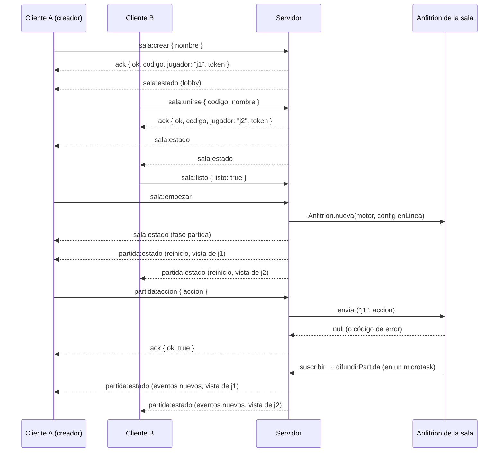
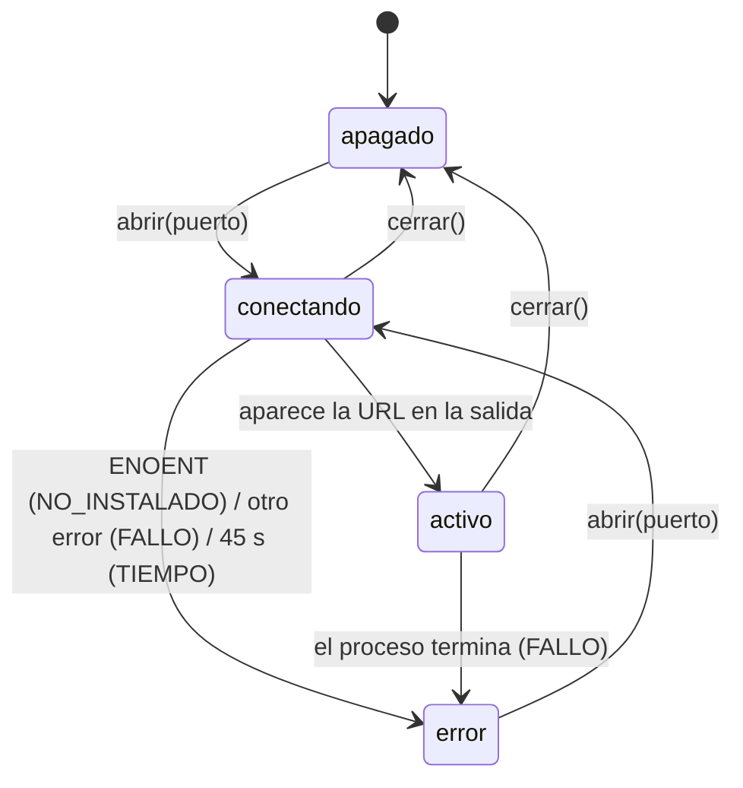

# Servidor en línea y protocolo de red

**Resumen.** `apps/server` es un servidor **autoritativo**: Fastify sirve la aplicación web
compilada y Socket.IO lleva las salas, el lobby y las partidas. Cada sala en línea tiene su propio
[`Anfitrion`](ANFITRION.md), que es el único que toca el estado; los clientes solo envían
_intenciones_ (acciones) y reciben su **vista filtrada**. Todo lo que llega de un cliente se valida
con los esquemas Zod de `packages/anfitrion/src/protocolo.ts`. Las salas viven en memoria: al
apagar el servidor desaparecen.

Para jugar (arrancar, invitar, túnel) ver la guía [EN_LINEA.md](EN_LINEA.md); para el ejecutable de
Windows, [ESCRITORIO.md](ESCRITORIO.md); para el cliente web (`ClienteEnLinea`), [WEB.md](WEB.md);
para el encaje general, [ARQUITECTURA.md](ARQUITECTURA.md).

## Archivos

| Archivo                                                    | Contenido                                                                |
| ---------------------------------------------------------- | ------------------------------------------------------------------------ |
| `apps/server/src/servidor.ts`                              | `crearServidor`: Fastify + Socket.IO, manejadores y difusión de estados. |
| `apps/server/src/salas.ts`                                 | `Sala` y `GestorSalas`: asientos, tokens, lobby, limpieza.               |
| `apps/server/src/arranque.ts`                              | `arrancar`, `mostrarDirecciones`, `apagarAlSalir` (comunes con el exe).  |
| `apps/server/src/principal.ts`                             | Punto de entrada de `pnpm servidor`; lee las variables de entorno.       |
| `apps/server/src/red.ts`                                   | `ipRedLocal` y `buscarCloudflared`.                                      |
| `apps/server/src/tunel.ts`                                 | `Tunel`: lanza `cloudflared` y lee la dirección pública.                 |
| `apps/server/src/escritorio.ts`, `principal-escritorio.ts` | El ejecutable (ver [ESCRITORIO.md](ESCRITORIO.md)).                      |
| `packages/anfitrion/src/protocolo.ts`                      | Nombres de los mensajes, esquemas Zod y tipos de las respuestas.         |

Tests en `apps/server/test/` (clientes reales de `socket.io-client` contra un servidor en un puerto
aleatorio): `servidor.test.ts`, `celebracion.test.ts`, `estaticos.test.ts`, `red.test.ts`,
`tunel.test.ts`, `escritorio.test.ts` e `icono.test.ts`. Ver [PRUEBAS.md](PRUEBAS.md).

## Flujo completo



## `crearServidor(opciones)`

```ts
crearServidor(o: OpcionesServidor): ServidorHts
// ServidorHts = { app, io, salas, escuchar(puerto, host = '0.0.0.0'), cerrar() }
```

| Opción                       | Por defecto     | Uso                                                                         |
| ---------------------------- | --------------- | --------------------------------------------------------------------------- |
| `motor`                      | (obligatoria)   | Motor creado con `crearMotor(cartas)`.                                      |
| `dirWeb`                     | sin web         | Carpeta de la web compilada. Si no existe, no se sirve nada estático.       |
| `reloj`                      | `RELOJ_REAL`    | Reloj de los anfitriones y de la limpieza de salas.                         |
| `opcionesAnfitrion`          | las del paquete | [`OpcionesAnfitrion`](ANFITRION.md#opcionesanfitrion) de cada partida.      |
| `inactividadSalaMs`          | 30 min          | Se borra una sala sin nadie conectado tras este tiempo.                     |
| `limiteMensajesPorSegundo`   | 40              | Mensajes por segundo y conexión.                                            |
| `tunel`                      | `cloudflared`   | `OpcionesTunel` (los tests pasan un ejecutable falso).                      |
| `registro`                   | `false`         | Activa el logger de Fastify.                                                |
| `alEnviarPartida`, `semilla` | —               | Solo tests: observar cada estado enviado; fijar la semilla de las partidas. |

- `escuchar(puerto)` escucha en `0.0.0.0` (toda la red local) y devuelve el puerto real (con `0`, el
  sistema elige uno libre).
- `cerrar()` cierra el túnel, para la limpieza, destruye todas las salas (y sus anfitriones) y cierra
  Socket.IO y Fastify.
- `GET /api/estado` responde `{ ok: true, salas: <número> }`. Lo usan Playwright para saber que el
  servidor está listo y el ejecutable para saber si ya hay uno en marcha.

## Salas (`salas.ts`)

- **Código:** 5 caracteres del alfabeto `ABCDEFGHJKLMNPQRSTUVWXYZ23456789` (sin O/0 ni I/1), con
  `crypto.randomInt`, único entre las salas abiertas. El cliente lo puede escribir en minúsculas:
  `CodigoSchema` lo pasa a mayúsculas.
- **Asientos:** de 2 (`MIN_ASIENTOS`) a 6 (`MAX_ASIENTOS`), contando bots. Los ids son `j1`, `j2`…
  en orden de llegada. Cada asiento tiene `nombre`, `control` (`humano`, `facil` o `normal`),
  `listo`, `token` y el conjunto de `sockets` abiertos (un jugador puede tener varias pestañas).
- **Token:** 16 bytes aleatorios en hexadecimal (32 caracteres), solo para los humanos. Es el secreto
  para `sala:reanudar`; el cliente lo guarda en `localStorage` (`hts:sesion`). Nunca se envía a los
  demás: `estadoPublico()` no lo incluye.
- **Creador:** el primer humano. Solo él cambia opciones, añade o quita asientos, empieza y vuelve a
  la sala. Si se va en el lobby, el siguiente humano pasa a ser el creador.
- **Bots:** se añaden con nombres de una lista fija (`Bot Bigotes`, `Bot Zarpas`…) y siempre están
  `listo`.
- **Nombres:** de 1 a 20 caracteres, sin repetir dentro de la sala (sin distinguir mayúsculas).
- **Opciones por defecto** (`OPCIONES_SALA_POR_DEFECTO`): reglas `normal`, `SEGUNDOS_POR_DEFECTO` y sin
  límite por decisión.
- **Fases:** `lobby` → `partida` (al empezar) → `terminada` (cuando el anfitrión tiene ganador; la
  marca `difundirPartida`) → `lobby` (con `sala:volver`; los humanos vuelven a "no listo").
- **Inactividad:** cada minuto, `GestorSalas.limpiar` borra las salas que llevan
  `inactividadSalaMs` sin ninguna conexión. En el lobby, si el último humano **sale**
  (`sala:salir`), la sala se borra en el acto.

### Salir y desconectarse

| Situación                            | En el lobby                         | En la partida                                        |
| ------------------------------------ | ----------------------------------- | ---------------------------------------------------- |
| `sala:salir`                         | Libera el asiento.                  | El asiento se queda; `anfitrion.desconectar(id)`.    |
| Se cierra la conexión (`disconnect`) | El asiento se queda (desconectado). | `anfitrion.desconectar(id)` si no le quedan sockets. |
| `sala:reanudar` con el token         | Vuelve al asiento.                  | `anfitrion.reconectar(id)` y recibe el historial.    |

Tras 60 s desconectado, un bot normal juega por él hasta que vuelva (ver
[ANFITRION.md](ANFITRION.md#desconexión-y-reconexión-modo-enlinea)). Al empezar, los humanos que no
tengan ninguna conexión abierta se marcan como desconectados.

## Mensajes Socket.IO

Los nombres están en `MENSAJES` (`protocolo.ts`). Todos los mensajes del cliente se envían con
_acknowledgement_: el servidor responde con un `Ack<T>`:

```ts
type Ack<T> = ({ ok: true } & T) | { ok: false; error: ErrorSala | string };
```

Cada manejador pasa por `manejar()`, que aplica el límite de mensajes por segundo
(`DEMASIADOS_MENSAJES`), valida con Zod (`DATOS_INVALIDOS`) y captura cualquier excepción
(`ERROR_INTERNO`, con el error en el log). El cliente web espera la respuesta como mucho 10 s.

### Cliente → servidor

| Mensaje          | Payload (esquema Zod)                                  | Respuesta `ok`                      | Errores propios                                                                      |
| ---------------- | ------------------------------------------------------ | ----------------------------------- | ------------------------------------------------------------------------------------ |
| `sala:crear`     | `{ nombre }` (`PeticionCrearSchema`)                   | `Sesion` (`codigo, jugador, token`) | —                                                                                    |
| `sala:unirse`    | `{ codigo, nombre }` (`PeticionUnirseSchema`)          | `Sesion`                            | `SALA_NO_EXISTE`, `PARTIDA_EMPEZADA`, `SALA_LLENA`, `NOMBRE_REPETIDO`                |
| `sala:reanudar`  | `{ codigo, token }` (`PeticionReanudarSchema`)         | `Sesion`                            | `SESION_INVALIDA`                                                                    |
| `sala:listo`     | `{ listo: boolean }` (`PeticionListoSchema`)           | `{}`                                | `SIN_SALA`, `PARTIDA_EMPEZADA`                                                       |
| `sala:opciones`  | `OpcionesSala` (`OpcionesSalaSchema`) — creador        | `{}`                                | `SIN_SALA`, `SOLO_CREADOR`, `PARTIDA_EMPEZADA`                                       |
| `sala:anadirBot` | `{ nivel: 'facil' \| 'normal' }` — creador             | `{}`                                | `SIN_SALA`, `SOLO_CREADOR`, `PARTIDA_EMPEZADA`, `SALA_LLENA`                         |
| `sala:quitar`    | `{ jugador }` (`PeticionQuitarSchema`) — creador       | `{}`                                | `SIN_SALA`, `SOLO_CREADOR`, `PARTIDA_EMPEZADA`, `DATOS_INVALIDOS` (si es él mismo)   |
| `sala:empezar`   | — (creador)                                            | `{}`                                | `SIN_SALA`, `SOLO_CREADOR`, `PARTIDA_EMPEZADA`, `POCOS_JUGADORES`, `NO_ESTAN_LISTOS` |
| `sala:volver`    | — (creador; solo con la partida `terminada`)           | `{}`                                | `SIN_SALA`, `SOLO_CREADOR`, `PARTIDA_EMPEZADA`                                       |
| `sala:salir`     | —                                                      | `{}`                                | —                                                                                    |
| `partida:accion` | `{ accion }` (`PeticionAccionSchema` + `AccionSchema`) | `{}`                                | `SIN_SALA`, `SIN_PARTIDA`, o el `CodigoError` del motor o del anfitrión              |
| `tunel:abrir`    | —                                                      | `{}`                                | `SOLO_EQUIPO_SERVIDOR`                                                               |
| `tunel:cerrar`   | —                                                      | `{}`                                | `SOLO_EQUIPO_SERVIDOR`                                                               |

Detalles de validación (`protocolo.ts`):

- `NombreSchema`: texto recortado de 1 a 20 caracteres. `CodigoSchema`: 5 caracteres `[A-Z0-9]`
  tras pasar a mayúsculas. `TokenSchema`: 32 caracteres hexadecimales en minúscula.
- `OpcionesSalaSchema`: `reglas` (`normal` o `dificil`), `segundos` (cada ventana, entero de 1 a 60) y `limiteDecisionS` (entero de 10 a 600, o `null`).
- `AccionSchema`: unión discriminada por `tipo` de **todas las acciones de jugador** del motor, con
  objetos `strict` (sin campos de más), uids de hasta 80 caracteres, listas de hasta 20 y números
  acotados. **`CERRAR_VENTANA` no está**: solo la envía el anfitrión como `SISTEMA`. `RESPONDER`
  usa `RespuestaSchema` (una de las formas `{ jugador }`, `{ cartas }`, `{ indice }`, `{ si }`,
  `{ valor }`, `{ ok: true }`). `leerAccion` valida y convierte al tipo `Accion` del motor (o devuelve
  `null`).
- Con la partida detenida (presentación de Líder, celebración o pausa de resultado), una acción
  responde `{ ok: false, error: 'PRESENTACION_LIDER' | 'CELEBRACION' | 'PAUSA_RESULTADO' }`.

### Servidor → cliente

| Mensaje          | Payload              | Cuándo                                                                                                      |
| ---------------- | -------------------- | ----------------------------------------------------------------------------------------------------------- |
| `servidor:info`  | `InfoServidor`       | Al conectar. `{ esEquipoServidor, redLocal }`; `redLocal` (`http://ip:puerto`) solo al equipo del servidor. |
| `tunel:estado`   | `EstadoTunel`        | Al conectar y a **todas** las conexiones cuando cambia: `{ fase, url, error }`.                             |
| `sala:estado`    | `EstadoSala \| null` | A la sala tras cada cambio del lobby. `null` a quien ha sido quitado de la sala.                            |
| `partida:estado` | `EstadoPartida`      | A cada jugador por separado, al empezar, al (re)conectar y tras cada cambio del anfitrión.                  |

`EstadoSala`: `{ codigo, creador, fase, asientos: AsientoPublico[], opciones }`, con
`AsientoPublico = { id, nombre, control, listo, conectado }` (un bot siempre cuenta como conectado).

`EstadoTunel`: `fase` es `apagado`, `conectando`, `activo` o `error`; `url` es la dirección
`https://….trycloudflare.com` cuando está activo; `error` es `NO_INSTALADO`, `FALLO`, `TIEMPO` o `RED_BLOQUEADA` (la red no deja salir por el
puerto 7844, el que usa `cloudflared`).

### `EstadoPartida`, campo a campo

Lo construye `enviarPartidaA` para **un** jugador. Nada de lo que contiene es información oculta de
otro jugador.

| Campo               | Contenido                                                                                                                                    |
| ------------------- | -------------------------------------------------------------------------------------------------------------------------------------------- |
| `yo`                | Id del jugador que recibe el estado.                                                                                                         |
| `modo`              | Reglas (`normal` o `dificil`).                                                                                                               |
| `jugadores`         | `JugadorConfig[]` de la partida (id, nombre, control).                                                                                       |
| `vista`             | `anfitrion.vistaDe(yo)`: la `VistaJugador` del motor (su mano; de los demás, solo lo público). Ver [MOTOR.md](MOTOR.md).                     |
| `legales`           | `anfitrion.legalesDe(yo)`: sus acciones legales ahora (`[]` con la partida detenida).                                                        |
| `motivos`           | `anfitrion.motivosDe(yo)`: por qué no es legal cada botón (ver [ANFITRION.md](ANFITRION.md#motivos-de-las-acciones-desactivadas-motivosts)). |
| `eventos`, `desde`  | Eventos desde el índice `desde`, filtrados con `eventoParaJugador` (las cartas robadas, sacadas o dadas solo se ven si le afectan).          |
| `reinicio`          | `true` si `eventos` sustituye al historial completo (al empezar o al conectar/reconectar).                                                   |
| `plazo`             | Ventana abierta: `{ secuencia, duracionMs, restanteMs }`; `restanteMs` es `null` si la cuenta está parada (detención). `null` sin ventana.   |
| `decision`          | Límite por decisión: `{ jugador, restanteMs }`, o `null`.                                                                                    |
| `celebracion`       | Monstruo matado que se celebra: `{ id, jugador, carta, duracionMs, restanteMs }`, o `null`.                                                  |
| `pausaResultado`    | `{ id, duracionMs, restanteMs }`, o `null`. El `id` se conserva si la pausa se alarga.                                                       |
| `presentacionLider` | Activación de Líder que se presenta: `{ id, jugador, carta, duracionMs, restanteMs }`, o `null`.                                             |
| `conexiones`        | `Record<JugadorId, 'conectado' \| 'desconectado' \| 'sustituido'>`.                                                                          |

Los tiempos van como **restantes** (no como instantes absolutos), porque los relojes del servidor y
del cliente no coinciden: el cliente calcula su propio `fin = recibido + restanteMs`. Las
`duracionMs` de las detenciones son las configuradas en el anfitrión, para que la animación de la web
dure lo mismo que la detención. Como el servidor difunde el estado al empezar y al terminar cada
detención, **todos los jugadores ven la presentación del Líder, la celebración y la pausa de
resultado a la vez**.

## Difusión de estados e historial

- El anfitrión de cada sala tiene una suscripción: `anfitrion.suscribir(() => difundirPartida(sala))`.
- `difundirPartida` **agrupa** los cambios seguidos: programa un único envío en un `queueMicrotask`
  por sala (`difusionPendiente`). En ese envío, si el anfitrión tiene ganador, la sala pasa a
  `terminada` y se envía `sala:estado`; después, cada socket de cada asiento recibe su
  `partida:estado`.
- **Eventos incrementales:** el servidor recuerda, por socket, el índice del siguiente evento que le
  falta (`indices`). Cada envío normal lleva solo los nuevos (`reinicio: false`).
- **Historial al conectar:** al empezar la partida, al unirse o al reanudar, se envían como mucho los
  últimos **300** eventos (`HISTORIAL_AL_CONECTAR`) con `reinicio: true`.

## Seguridad

- **El actor es siempre el jugador de la conexión.** `partida:accion` solo lleva la acción; el
  servidor usa el jugador asociado al socket (`socket.data.sesion`) como actor. No se puede actuar en
  nombre de otro ni enviar `CERRAR_VENTANA` (no está en `AccionSchema`, y el motor exige `SISTEMA`).
- **Vistas filtradas:** cada cliente recibe solo `getPlayerView` de su jugador y eventos pasados por
  `eventoParaJugador`. Los tests de `apps/server` comprueban con `alEnviarPartida` que no se filtra
  la mano de otro.
- **Validación Zod estricta** de todo lo que llega (objetos `strict`, longitudes y rangos acotados).
- **Límite de mensajes:** 40 por segundo y conexión por defecto; los que pasan del límite responden
  `DEMASIADOS_MENSAJES` sin procesarse.
- **Sesiones:** el token (128 bits aleatorios) es la única forma de recuperar un asiento.
- **Túnel solo desde el equipo del servidor:** `esDelEquipoServidor(direccion, cabeceras)` exige que la
  conexión venga de _loopback_ (`127.0.0.1`, `::1`, `::ffff:127.0.0.1`) **y** que no traiga
  cabeceras de reenvío (`cf-ray`, `cf-connecting-ip`, `cf-visitor`, `x-forwarded-for`). Las visitas
  por el túnel también llegan desde localhost (las reenvía `cloudflared`), pero con las cabeceras de
  Cloudflare, así que no cuentan como equipo del servidor. Solo él recibe `redLocal` y puede usar
  `tunel:abrir`/`tunel:cerrar` (si no, `SOLO_EQUIPO_SERVIDOR`).
- **Contraseña de acceso opcional** (`CLAVE_ACCESO`): ver
  [Protección por contraseña](#protección-por-contraseña).
- **Lo que no hay:** autenticación de usuarios ni HTTPS propio (en internet, el túnel de Cloudflare
  pone HTTPS). El servidor sirve las imágenes y textos de las cartas a quien tenga la dirección: es
  para jugar con amigos.

## Protección por contraseña

Si la variable `CLAVE_ACCESO` está definida, el servidor exige haber entrado antes por la página
`/acceso` para servir **la web, la API, las imágenes de las cartas y la conexión Socket.IO**. Al
introducir la contraseña correcta guarda una cookie `HttpOnly` firmada, válida 30 días. Los enlaces
de invitación (`?sala=…`) piden la contraseña y luego llevan a la sala. La ruta `/salud` es pública
(la usa el chequeo de Render; responde `{ ok: true }`). Sin la variable, no se protege nada
(`pnpm servidor`, el `.exe`). Se usa en el despliegue en la nube: ver [DESPLIEGUE.md](DESPLIEGUE.md).

Detalles de `apps/server/src/acceso.ts` (`protegerConClave`, `tieneAcceso`):

- La cookie se llama `hts_acceso` y su valor es `caducidad.firma`. La firma es un HMAC cuya clave
  se deriva de la contraseña con `scrypt` (lento a propósito), así que una cookie filtrada no sirve
  para adivinar la contraseña sin conexión. La caducidad (30 días) se comprueba **en el servidor**,
  aunque el navegador conserve la cookie. **Cambiar `CLAVE_ACCESO` invalida todas las sesiones.**
- Sin cookie válida, un `GET` que acepta HTML se redirige a `/acceso?volver=<ruta>`; el resto
  responde `401` con `{ ok: false, error: 'SIN_ACCESO' }`. `rutaSegura` solo admite rutas internas
  en `volver`: rechaza los caracteres de control y la barra invertida, e interpreta la ruta con
  `URL` para comprobar que el origen sigue siendo el interno (y que no apunta a `/acceso`).
- Socket.IO no pasa por las rutas de Fastify: se protege con `allowRequest` y `tieneAcceso`.
- **Límite de intentos** (`POST /acceso`, respuesta `429`): máximo de **10 fallos por IP** cada 10
  minutos y, además, un **tope total de 50 fallos cada 10 minutos**, sea cual sea la IP. Con la
  protección activa se activa `trustProxy`, de modo que tras el proxy de Render la IP sale de
  `X-Forwarded-For`; pero esa cabecera **puede inventarla el cliente**, y por eso existe el tope
  total (el límite por IP, por sí solo, se saltaría cambiando la cabecera). Se recuerdan como mucho
  1000 IP. Consecuencia: quien pruebe muchas contraseñas puede **bloquear durante 10 minutos las
  entradas nuevas de todos**; las sesiones ya abiertas (cookie válida) siguen funcionando. Una
  contraseña larga lo hace inútil como ataque de adivinación. Un acierto borra los fallos de esa IP.
- **Caché:** con contraseña, un hook `onSend` hace que toda respuesta lleve `Cache-Control` con
  `private` (`private, no-store` si no traía cabecera; si traía otra, se le antepone `private`).
  Además, `/assets` y `/cartas` pasan de `public` a `private` (tabla de abajo).
- **Página `/acceso`:** lleva `X-Frame-Options: DENY` y `Content-Security-Policy: frame-ancestors
'none'` para que no se pueda incrustar en otra web. La cookie es `HttpOnly; SameSite=Lax` y
  `Secure` cuando la petición llega por HTTPS (directo o por `X-Forwarded-Proto`).

## Web estática y caché

Si `dirWeb` existe, se registran `@fastify/compress` (gzip/brotli) y `@fastify/static` con estas
cabeceras `Cache-Control`:

| Ruta                               | Cabecera                              | Por qué                               |
| ---------------------------------- | ------------------------------------- | ------------------------------------- |
| `/assets/…`                        | `public, max-age=31536000, immutable` | Nombres con hash de Vite: no cambian. |
| `/cartas/…`                        | `public, max-age=86400`               | Imágenes de las cartas (un día).      |
| Todo lo demás (`index.html`, etc.) | `no-cache`                            | Siempre la versión actual de la web.  |

La compresión y la caché se notan sobre todo a través del túnel. El cliente de Socket.IO no lo sirve
el servidor (`serveClient: false`): va dentro de la web compilada.

## Arranque: `arranque.ts` y `principal.ts`

- `arrancar({ rutaCartas, dirWeb, puerto, opcionesAnfitrion? })` lee y valida
  `cartas.es.json` con `ArchivoCartasSchema`, crea el motor, crea el servidor y escucha. Si no puede
  escuchar (por ejemplo, el puerto está ocupado), cierra lo creado y relanza el error.
- `mostrarDirecciones(puerto, alCerrar)` imprime la dirección local y la de la red local
  (`ipRedLocal`), con instrucciones para invitar.
- `apagarAlSalir(servidor)` cierra el servidor con `SIGINT` (Ctrl+C) o `SIGTERM`.
- `principal.ts` es el punto de entrada de `pnpm servidor` (que antes ejecuta `pnpm build`) y de
  `pnpm --filter @hts/server start` (sin compilar la web). Lee las cartas de
  `Referencias/cartas.es.json` y las variables de entorno.

### Variables de entorno

| Variable                | Por defecto     | Efecto                                                                                           |
| ----------------------- | --------------- | ------------------------------------------------------------------------------------------------ |
| `PUERTO`                | `3000`          | Puerto en el que escucha. Si no existe, se lee `PORT`.                                           |
| `PORT`                  | —               | Puerto que define la plataforma (Render). Solo se usa si no hay `PUERTO`.                        |
| `CLAVE_ACCESO`          | sin definir     | Contraseña de acceso. Si existe, activa la protección (ver más abajo).                           |
| `DIR_WEB`               | `apps/web/dist` | Carpeta de la web compilada, relativa a la raíz del repositorio. El e2e usa `apps/web/dist-e2e`. |
| `RETARDO_BOT_MS`        | 700             | `retardoBotMs` del anfitrión.                                                                    |
| `CELEBRACION_MS`        | 4000            | `celebracionMs` (0 la desactiva).                                                                |
| `PAUSA_RESULTADO_MS`    | 3000            | `pausaResultadoMs` (0 la desactiva).                                                             |
| `PRESENTACION_LIDER_MS` | 4000            | `presentacionLiderMs` (0 la desactiva).                                                          |
| `CLOUDFLARED`           | se busca        | Ruta del ejecutable de `cloudflared` (ver más abajo).                                            |

Las cuatro de milisegundos existen sobre todo para las pruebas e2e, que las bajan
(`apps/e2e/playwright.config.ts`: 40, 300, 50 y 50 ms) para que las partidas vayan rápidas. El
ejecutable de escritorio **no** lee `PUERTO`, `DIR_WEB` ni las de milisegundos (ver
[ESCRITORIO.md](ESCRITORIO.md)); `CLOUDFLARED` sí, porque la usa `buscarCloudflared`.

## Red local y túnel (`red.ts`, `tunel.ts`)

### `ipRedLocal()`

Devuelve la IPv4 del equipo en la red de casa, o `null`. Descarta las interfaces internas, las
direcciones `169.254.x.x` y los adaptadores virtuales (por nombre: WSL, Hyper-V, VirtualBox, VMware,
Docker, VPN como Tailscale o ZeroTier, Bluetooth…; y por prefijo de MAC). Si quedan varias, prefiere
`192.168.x.x`, luego `10.x.x.x` y luego `172.16–31.x.x`.

### `buscarCloudflared()`

1. La variable `CLOUDFLARED`, si está definida y no vacía.
2. En Windows: `cloudflared\cloudflared.exe` dentro de `Program Files` y `Program Files (x86)`, el
   enlace de WinGet (`%LOCALAPPDATA%\Microsoft\WinGet\Links`) y los paquetes de WinGet
   `Cloudflare.cloudflared*`. En macOS/Linux: `/opt/homebrew/bin`, `/usr/local/bin` y `/usr/bin`.
3. Si no está en ninguna, `cloudflared` (se busca en el `PATH`).

Se buscan las carpetas de instalación porque winget no siempre añade el programa al `PATH`, y una
terminal abierta antes de instalarlo no ve el `PATH` nuevo.

### `Tunel`

`tunel:abrir` lanza un **túnel rápido** de Cloudflare
(`cloudflared tunnel --no-autoupdate --url http://127.0.0.1:<puerto>`) y lee su salida hasta
encontrar una dirección `https://….trycloudflare.com`:



Cada cambio se difunde a **todas** las conexiones con `tunel:estado` (los invitados ven el enlace,
pero no pueden abrir ni cerrar el túnel). `cerrar()` mata el proceso; el servidor lo llama también
al apagarse. La dirección cambia cada vez que se abre el túnel.

## Desarrollo

- `pnpm --filter @hts/server start` arranca el servidor en :3000 sin compilar la web; `pnpm dev`
  sirve la web en :5173 y Vite redirige `/socket.io` a `http://localhost:3000`
  (`apps/web/vite.config.ts`).
- **Añadir un mensaje:** su nombre en `MENSAJES`, su esquema Zod en `protocolo.ts` (con `strict()`),
  su manejador con `manejar()` en `servidor.ts` (que devuelva un `Ack`), el método en
  `apps/web/src/enlinea/cliente.ts` y un test en `apps/server/test/`.
- **Añadir un campo a `EstadoPartida`:** el tipo en `protocolo.ts`, el valor en `enviarPartidaA` y
  su lectura en el cliente. Comprueba que no filtra información oculta.
