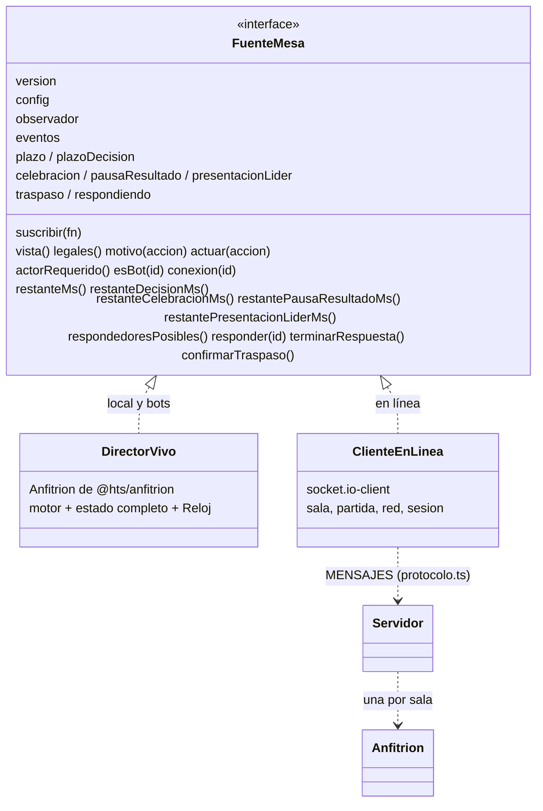
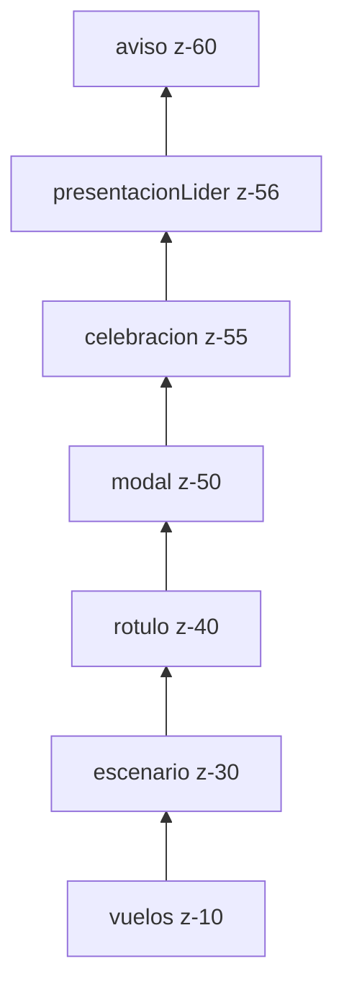

# Aplicación web (`apps/web`)

**Resumen.** `apps/web` es la interfaz del juego: una SPA en React que pinta la mesa a partir de la
_vista filtrada_ de un jugador y envía sus acciones. No contiene reglas: todo lo decide el motor
(`@hts/engine`) a través de un host, el `Anfitrion` de `@hts/anfitrion`. La mesa no sabe si la
partida es local o en línea: lee siempre de una [`FuenteMesa`](#4-fuentemesa-local-y-en-línea), que
en local es el propio `Anfitrion` (`DirectorVivo`) y en línea es `ClienteEnLinea`, que recibe lo
mismo del servidor por Socket.IO.

Documentos relacionados: [ARQUITECTURA.md](ARQUITECTURA.md) (visión de conjunto),
[ANFITRION.md](ANFITRION.md) (temporizadores, bots y detenciones),
[SERVIDOR_Y_PROTOCOLO.md](SERVIDOR_Y_PROTOCOLO.md), [MOTOR.md](MOTOR.md),
[PRUEBAS.md](PRUEBAS.md) y [GLOSARIO.md](GLOSARIO.md).

## Índice

1. [Stack y estructura](#1-stack-y-estructura)
2. [Catálogo de cartas e imágenes](#2-catálogo-de-cartas-e-imágenes)
3. [Estado de la aplicación](#3-estado-de-la-aplicación)
4. [`FuenteMesa`: local y en línea](#4-fuentemesa-local-y-en-línea)
5. [Pantallas y carga diferida](#5-pantallas-y-carga-diferida)
6. [La mesa](#6-la-mesa)
7. [Capas y detenciones](#7-capas-y-detenciones)
8. [Componentes base: `Carta`, imágenes y `Logo`](#8-componentes-base-carta-imágenes-y-logo)
9. [Guardado](#9-guardado)
10. [Textos (i18n)](#10-textos-i18n)
11. [Accesibilidad](#11-accesibilidad)
12. [Temas claro y oscuro](#12-temas-claro-y-oscuro)
13. [Rendimiento](#13-rendimiento)
14. [Piloto e2e y atributos `data-*`](#14-piloto-e2e-y-atributos-data-)
15. [Cómo añadir una pantalla o un componente a la mesa](#15-cómo-añadir-una-pantalla-o-un-componente-a-la-mesa)

## 1. Stack y estructura

| Pieza                 | Uso                                                                        |
| --------------------- | -------------------------------------------------------------------------- |
| React 19              | Componentes funcionales y hooks; `StrictMode` en `src/main.tsx`.           |
| Vite 6                | Desarrollo (`pnpm dev`, puerto 5173) y compilación (`build`, `build:e2e`). |
| Zustand 5             | Estado global de la aplicación (`src/estado/app.ts`).                      |
| Tailwind 4            | Estilos; tema y colores de clase en `src/estilos.css` (`@theme`).          |
| Framer Motion 12      | Animaciones (escenario, vuelos, rótulo, celebración, presentación).        |
| socket.io-client 4    | Conexión con el servidor en línea (`src/enlinea/cliente.ts`).              |
| Vitest + Testing Lib. | Tests en `apps/web/test` (jsdom; algunos en entorno node). Ver PRUEBAS.md. |

En desarrollo, Vite redirige `/socket.io` a `http://localhost:3000` (`vite.config.ts`), de modo que
`pnpm dev` puede jugar en línea si hay un servidor arrancado. `scripts/limpiar-dist.mjs` vacía la
carpeta de salida antes de compilar (con un recurso para carpetas sincronizadas de OneDrive en
Windows).

```
apps/web/src
├── main.tsx            punto de entrada (y carga del piloto solo en --mode e2e)
├── App.tsx             enrutado por estado, tema, animaciones, invitaciones
├── estilos.css         Tailwind, variante dark, colores de clase, .reducir-movimiento
├── entorno.d.ts        tipo del módulo virtual `virtual:cartas`
├── estado/             app.ts (Zustand) y contexto.tsx (catálogo y hooks)
├── juego/              fuente.ts, director-vivo.ts, config.ts, opciones.ts, catalogo.ts,
│                       guardado.ts, autoguardado.ts, vuelos.ts
├── enlinea/            cliente.ts (ClienteEnLinea) y sesion.ts (localStorage)
├── pantallas/          Inicio, Configurar, EnLinea, Sala, Invitar, Reglas, Tutorial,
│   │                   ErrorCatalogo
│   └── mesa/           Mesa y sus piezas; escenario/ (Ventanas, Finales, Piezas)
├── ui/                 Carta, DetalleCarta, Modal, Boton, Logo, Ajustes, SelectorTema,
│                       capas.ts, useImagen.ts, imagenesFallidas.ts, rango.ts
├── i18n/               es.json y index.ts (t, lista, existe, conSigno)
└── e2e/piloto.ts       solo en la compilación de pruebas
```

## 2. Catálogo de cartas e imágenes

**Módulo virtual `virtual:cartas`.** El plugin `cartasPlugin` de `vite.config.ts` resuelve el
import `virtual:cartas` con el contenido de `Referencias/cartas.es.json` (recurso personal, no
versionado) o con `null` si el archivo no existe. En desarrollo vigila el archivo
(`addWatchFile`). El tipo está declarado en `src/entorno.d.ts` como `unknown`.

Al arrancar, `App.tsx` llama a `prepararCatalogo(cartasCrudas)` (`src/juego/catalogo.ts`), que:

1. devuelve `{ ok: false, motivo: 'falta' }` si no hay archivo;
2. lo valida con `ArchivoCartasSchema` (Zod, `@hts/cards`) y, si falla, devuelve
   `{ ok: false, motivo: 'invalido', detalle }` con la primera incidencia;
3. si es válido, crea el motor con `crearMotor(cartas)`.

Si falla, `App` pinta `ErrorCatalogo` en lugar de la aplicación. Si va bien, envuelve todo en
`ProveedorCatalogo` (ver §3).

**Imágenes.** `vite.config.ts` usa `assets/` (raíz del repositorio) como `publicDir`, así que
`assets/cartas/<archivo>` se sirve en `/cartas/<archivo>`. Cada carta del catálogo trae su
`imagen`; el reverso y el logo usan las constantes `IMAGEN_REVERSO` e `IMAGEN_LOGO` de
`@hts/cards`. Sin imágenes el juego sigue siendo jugable: `Carta` dibuja una carta genérica y
`Logo` muestra texto (§8). Los recursos se instalan con `pnpm recursos` (ver el `README.md`).

## 3. Estado de la aplicación

### `estado/app.ts` (Zustand)

`useApp` guarda el estado global que no pertenece a una partida:

| Campo                | Significado                                                                    |
| -------------------- | ------------------------------------------------------------------------------ |
| `pantalla`           | `'inicio' \| 'configurar' \| 'mesa' \| 'reglas' \| 'enLinea' \| 'sala'`.       |
| `anterior`           | Pantalla a la que vuelve `volver()` (se usa desde Reglas).                     |
| `tema`               | `'sistema' \| 'claro' \| 'oscuro'`, persistido en `localStorage` (`hts:tema`). |
| `reducirAnimaciones` | `true`/`false` elegido en Ajustes o `null` (seguir al sistema).                |
| `tutorial`           | Si el tutorial (modal) está abierto.                                           |
| `director`           | `DirectorVivo` de la partida local en curso, o `null`.                         |
| `cliente`            | `ClienteEnLinea` de las pantallas en línea, o `null`.                          |

Acciones: `irA`, `volver`, `cambiarTema`, `cambiarReducirAnimaciones` (persiste en
`hts:reducirAnimaciones` como `si`/`no`), `mostrarTutorial`, `empezar(director)` (destruye el
director anterior y va a la mesa), `salir()` (destruye el director y vuelve al inicio),
`abrirEnLinea(cliente, pantalla)` (cierra un cliente previo distinto) y `cerrarEnLinea()`.

`useReducirAnimaciones()` combina la preferencia elegida con `prefers-reduced-motion` (escuchado con
`useSyncExternalStore`): lo elegido manda; si es `null`, decide el sistema. Todos los accesos a
`localStorage` van en `try/catch` (en modo privado la preferencia solo dura la sesión).

No hay router: `App.tsx` pinta la pantalla según `pantalla`. Un enlace de invitación
`…/?sala=CÓDIGO` se lee una vez al cargar (`leerInvitacion`), se quita de la URL y abre
`EnLinea` con el código ya escrito, o directamente la `Sala` si este navegador ya tenía sesión en
esa sala.

### `estado/contexto.tsx`

- `ProveedorCatalogo` / `useCatalogo()`: el `motor` y las `cartas` validadas.
- `useCarta(id)`: datos de catálogo de una carta (o `undefined`).
- `useDirector(fuente)`: se suscribe a una `FuenteMesa` con `useSyncExternalStore` usando
  `suscribir` y `version`; el componente se vuelve a pintar cada vez que la fuente notifica.
- `useAhora(activo, ms = 100)`: instante actual refrescado cada `ms` mientras `activo` (para las
  cuentas atrás).

### Configuración y opciones

- `juego/config.ts` reexporta de `@hts/anfitrion` los tipos y utilidades de configuración
  (`ConfigLocal = ConfigAnfitrion`, `ModoJuego`, `Control`, `Dificultad`, `semillaAleatoria`,
  `nivelDeBot`, `SEGUNDOS_POR_DEFECTO`, `aConfigPartida`) y añade `esHumano`.
- `juego/opciones.ts` define `OPCIONES_DIRECTOR`: vacío en la compilación normal (valores por
  defecto del anfitrión) y, en `--mode e2e`, `retardoBotMs: 40`, `celebracionMs: 300`,
  `pausaResultadoMs: 50` y `presentacionLiderMs: 50` para que las partidas e2e vayan rápidas.

<a id="fuentemesa-local-y-en-línea"></a>

## 4. `FuenteMesa`: local y en línea

`FuenteMesa` (`src/juego/fuente.ts`) es el contrato entre la mesa y quien lleva la partida. La mesa
solo usa esta interfaz, así que el mismo componente `Mesa` sirve para las tres modalidades
(`'local'` = este dispositivo, `'bots'` y `'enLinea'`).



| Miembro                                                                    | Qué da a la mesa                                                                                                        |
| -------------------------------------------------------------------------- | ----------------------------------------------------------------------------------------------------------------------- |
| `version`, `suscribir`                                                     | Contador que sube con cada cambio y suscripción (para `useDirector`).                                                   |
| `config`                                                                   | `modo` y `jugadores` (nombre y `control`: `humano` o nivel de bot).                                                     |
| `observador`                                                               | Jugador cuya vista se pinta («yo»).                                                                                     |
| `eventos`                                                                  | Eventos que puede conocer quien mira: historial, escenario y vuelos.                                                    |
| `vista()`                                                                  | `VistaJugador` filtrada del motor.                                                                                      |
| `legales()`, `motivo(a)`                                                   | Acciones legales y, si una no lo es, su `CodigoError` (los botones lo traducen con `errores.<código>`).                 |
| `actuar(a)`                                                                | Envía una acción como el observador.                                                                                    |
| `actorRequerido()`                                                         | Quién debe actuar ahora (turno o cima de la pila), para «Esperando a X…».                                               |
| `esBot`, `conexion`                                                        | Insignias de bot y de conexión en cada Grupo.                                                                           |
| `plazo`, `restanteMs()`                                                    | Cuenta atrás de la ventana abierta (`fin: null` = en pausa).                                                            |
| `plazoDecision`, `restanteDecisionMs()`                                    | Límite por decisión, si la partida lo tiene.                                                                            |
| `celebracion`, `pausaResultado`, `presentacionLider` y sus `restante…Ms()` | Las **detenciones** del anfitrión (§7).                                                                                 |
| `traspaso`, `respondiendo` y métodos asociados                             | Solo en «este dispositivo» (hot-seat): pasar el dispositivo y turnos de respuesta. En línea son `null` o no hacen nada. |

### `DirectorVivo` (local)

`src/juego/director-vivo.ts` solo reexporta `Anfitrion as DirectorVivo` (y `RELOJ_REAL`, `Reloj`,
`Plazo`, `OpcionesDirector`) desde `@hts/anfitrion`: el host local es exactamente el mismo que usa
el servidor. Tiene el estado completo de la partida y el `Reloj` real; mide plazos, programa bots
y decide las detenciones. Sus detalles están en [ANFITRION.md](ANFITRION.md).

Se crea en `App.tsx` con `DirectorVivo.nueva(motor, config, undefined, OPCIONES_DIRECTOR)`
(importado con `import()`) o, al continuar o cargar una partida, con `restaurarGuardado` (§9).
`useApp.empezar`/`salir` llaman a `destruir()` del director anterior para cancelar sus
temporizadores.

En local, los plazos y detenciones son campos vivos del anfitrión: `plazo.fin` es un instante del
`Reloj`, y `celebracion`, `pausaResultado` y `presentacionLider` valen `null` en cuanto acaban
(el anfitrión notifica en ese momento).

### `ClienteEnLinea` (en línea)

`src/enlinea/cliente.ts` implementa `FuenteMesa` sobre Socket.IO. Lo que recibe del servidor ya
está filtrado para su jugador.

- **Conexión.** `io({ transports: ['websocket', 'polling'], reconnection: true })`. `red` vale
  `'conectando' | 'conectado' | 'desconectado'`; al (re)conectar, si hay `sesion`, llama a
  `reanudar()`. La pantalla `Sala` muestra un aviso «Reconectando…» en la capa `aviso` mientras
  `red === 'desconectado'`.
- **Sesión.** `crear`, `unirse` y `reanudar` reciben `{ codigo, jugador, token }` y lo guardan en
  `localStorage` con la clave `hts:sesion` (`src/enlinea/sesion.ts`). Así, tras recargar la
  página, la portada ofrece «Volver a tu sala» y el cliente se reanuda con el token. Si el
  servidor responde `SESION_INVALIDA`, o manda `estadoSala: null` (te han quitado), el cliente
  olvida la sesión (`olvidarSesion`).
- **Peticiones.** `pedir()` emite con un _ack_ y un tiempo máximo de 10 s; sin conexión devuelve
  `SIN_CONEXION`. El último error queda en `error` y las pantallas lo traducen con
  `enLinea.errores.<código>`. Otras operaciones: `listo`, `cambiarOpciones`, `anadirBot`,
  `quitar`, `empezar`, `volverALaSala`, `salir`, `abrirTunel`/`cerrarTunel` (ver
  [EN_LINEA.md](EN_LINEA.md)).
- **Estado de partida.** Cada mensaje `estadoPartida` trae la vista, las legales, los motivos de
  las ilegales, las conexiones y los eventos nuevos (o todos, si `reinicio`). Los eventos se
  acumulan en `eventos`. `motivo(a)` busca la acción en `partida.motivos` (o `NO_ES_MOMENTO`).
  `actorRequerido()` se deduce de la vista (turno o cima de la pila), y `esBot(id)` es cierto
  también para un humano `sustituido` por un bot tras desconectarse.
- **Tiempos.** El servidor manda tiempos _restantes_ (`restanteMs`), no instantes. El cliente
  anota cuándo llegó el estado (`recibido`) y convierte cada uno en un `fin` local
  (`recibido + restanteMs`). Así se evita depender de que los relojes de los dos equipos
  coincidan.
- **Detenciones.** Para `celebracion`, `pausaResultado` y `presentacionLider` guarda
  `{ id, duracionMs, fin }` y programa un `setTimeout` (`programarFin…`) que notifica a la mesa
  20 ms después del `fin`, porque el servidor no manda un estado solo porque una detención
  termine. Los getters devuelven `null` en cuanto `Date.now() >= fin`. Si el servidor es antiguo y
  no manda `pausaResultado` o `presentacionLider`, se tratan como `null`.
- **Cuenta de decisión congelada.** Durante una detención el servidor congela el límite por
  decisión; `restanteDecisionMs()` devuelve entonces el valor recibido sin descontar tiempo.
- **Hot-seat.** `traspaso` y `respondiendo` son siempre `null`; `responder`,
  `terminarRespuesta` y `confirmarTraspaso` no hacen nada (cada jugador responde desde su
  dispositivo).
- `cerrar()` cancela los temporizadores, desconecta el socket y vacía las suscripciones.

## 5. Pantallas y carga diferida

| Pantalla      | Archivo                       | Qué hace                                                                                                                                                                                          |
| ------------- | ----------------------------- | ------------------------------------------------------------------------------------------------------------------------------------------------------------------------------------------------- |
| Inicio        | `pantallas/Inicio.tsx`        | Portada: continuar la partida autoguardada, jugar en este dispositivo o contra bots, volver a la sala en línea, jugar en línea, cargar archivo, reglas, tutorial y ajustes.                       |
| Configurar    | `pantallas/Configurar.tsx`    | Nueva partida local: modo, reglas normales o difíciles, jugadores (2–6 en este dispositivo; 1 persona y bots), dificultad, segundos de cada ventana y semilla. Valida nombres vacíos o repetidos. |
| EnLinea       | `pantallas/EnLinea.tsx`       | Crear una sala o unirse con un código de 5 caracteres.                                                                                                                                            |
| Sala          | `pantallas/Sala.tsx`          | Lobby (asientos, bots, opciones, «Estoy listo», empezar) e `Invitar` (enlaces y túnel); cuando la partida empieza, pinta `Mesa` con el cliente como fuente.                                       |
| Reglas        | `pantallas/Reglas.tsx`        | Resumen de reglas desde `reglas` de `es.json`; `ContenidoReglas` se reutiliza en el menú de la mesa.                                                                                              |
| Tutorial      | `pantallas/Tutorial.tsx`      | Modal por pasos (`tutorial.pasos`), abrible desde cualquier pantalla.                                                                                                                             |
| Mesa          | `pantallas/mesa/Mesa.tsx`     | La partida (§6).                                                                                                                                                                                  |
| ErrorCatalogo | `pantallas/ErrorCatalogo.tsx` | Falta `Referencias/cartas.es.json` o no es válido.                                                                                                                                                |

**Carga diferida.** `Inicio` y `ErrorCatalogo` se importan de forma estática. Las demás pantallas
usan `React.lazy` dentro de un `Suspense` con un `Cargando` accesible (`role="status"`). El
director (`juego/director-vivo`), el guardado (`juego/guardado`) y el cliente en línea
(`enlinea/cliente`) se cargan con `import()` en el momento de usarlos. Para saber si hay partida
guardada o sesión, la portada solo importa los módulos ligeros `juego/autoguardado.ts` y
`enlinea/sesion.ts`, que no arrastran el motor ni socket.io.

## 6. La mesa

`Mesa` recibe una `FuenteMesa` (`director`) y construye un `ValorMesa` que comparte con todas sus
piezas por `MesaContexto` (`pantallas/mesa/contexto.tsx`, hook `useMesa()`):

| Campo de `ValorMesa`                            | Uso                                                                               |
| ----------------------------------------------- | --------------------------------------------------------------------------------- |
| `director`, `vista`, `legales`, `yo`            | Fuente, vista filtrada, acciones legales y observador.                            |
| `esMiTurnoLibre`                                | Mi turno, pila vacía, sin ganador ni traspaso: se ofrecen las acciones del turno. |
| `enviar(a)`                                     | `director.actuar(a)`.                                                             |
| `motivo(a)`                                     | `null` si es legal; si no, el texto de `errores.<código>` (tooltip del botón).    |
| `nombreJugador`, `nombreCarta`, `idDe(uid)`     | Nombres y id de catálogo de una carta visible (`null` si está oculta).            |
| `ampliar`, `verDetalle`, `detalleDe`            | Carta ampliada en la barra lateral y ficha de detalle (`DetalleCarta`).           |
| `equipando`, `setEquipando`, `objetivosEquipar` | Equipar un Objeto: Héroes válidos según las legales.                              |

El valor se recalcula con `useMemo` cada vez que cambia `version`. `clave(valor)` serializa una
acción o respuesta con las claves ordenadas; `mismaAccion` compara acciones con ella, y la misma
`clave` se usa en los atributos `data-accion`/`data-respuesta` (§14).

En una partida local, un `useEffect` llama a `guardarAuto` tras cada cambio de `version` (§9).

### Disposición

```
┌ header: Logo · Turno N · «Tu turno»/«Turno de X» · PA · reglas · TiempoDecision · Menú ┐
├ main ─────────────────────────────────────────────────────┬ aside (lg) ──────────────┤
│ ZonaJugador de cada rival (rejilla)                        │ Carta ampliada           │
│ Centro: Monstruos, mazo, descarte                          │ Historial                │
│ «Esperando a X…» (si el que debe actuar es un bot)         │                          │
│ ZonaJugador propia                                         │                          │
│ AccionesTurno                                              │                          │
│ Mano                                                       │                          │
└────────────────────────────────────────────────────────────┴──────────────────────────┘
Superpuestos: Escenario · DialogoDecision · Vuelos · Traspaso · RotuloTurno · Victoria ·
DetalleCarta · modales (historial móvil, menú, rendirse, reglas) · Anunciador ·
CelebracionMonstruo · PresentacionLider
```

En pantallas estrechas el historial se abre en un modal («Ver historial»).

### Cabecera

- **Puntos de acción.** Se pinta un círculo por PA. El total es
  `max(PA_POR_TURNO, turno.paInicial, turno.pa)`: durante el turno se pintan siempre los del
  inicio, con los gastados vacíos. Los que superan `PA_POR_TURNO` (3) vienen de una pasiva (hoy la
  `monstruo_megababosa`) y se destacan en azul con anillo (`data-extra`). El grupo tiene
  `role="img"`, `data-pa` y una `aria-label` que dice cuántos quedan y, si hay extra, de dónde
  viene (`mesa.paRestantesExtra`, `mesa.paExtraDe`).
- **Modo de reglas** (`mesa.reglasModo.normal|dificil`), **tiempo de decisión**
  (`TiempoDecision`, solo si hay `plazoDecision`; en rojo cuando te quedan 10 s o menos) y la
  insignia de espectador si te has rendido.
- **Menú** (modal): exportar la partida (solo local), reglas, tutorial, `Ajustes`, rendirse (con
  confirmación; ver D-43 en [DUDAS_REGLAS.md](DUDAS_REGLAS.md)) y salir.

### Zonas de jugador (`ZonaJugador.tsx`)

Cada Grupo es una `section` con `aria-label` igual al nombre del jugador y
`data-zona="grupo:<id>"`. La cabecera muestra el nombre, insignias (rendido, conexión, bot y
nivel), las cartas en mano de los rivales (`data-zona="mano:<id>"`), los Monstruos matados y el
**contador de clases**. Debajo van el Líder, los Héroes (con su Objeto en miniatura) y los
Monstruos. En la zona propia, en tu turno libre, cada Héroe tiene «Usar efecto · 1 PA»
(`TIRAR_HEROE`). Al equipar un Objeto, los Héroes válidos se resaltan y los demás se atenúan; un
clic en un Héroe válido envía `JUGAR_CARTA` con `objetivo`.

**`ContadorClases.tsx`.** Muestra «Clases: N/6» a partir de `desgloseClases` del motor (que cuenta
el Líder, los Héroes y las máscaras). Es un botón con `aria-expanded`/`aria-controls` que despliega
el desglose por clase, con el origen de cada aporte (Líder o máscara con su Objeto) y «falta» en
las clases sin aporte. `estadoClases(total, monstruos, modo)` decide el color:

- `listo` (verde) solo si las clases ya bastan para ganar con las reglas activas;
- `cerca` (ámbar) con 5 clases, o con 6 que aún no bastan (reglas difíciles sin Monstruo);
- `normal` en el resto.

El estado también se dice con texto, no solo con color.

### Centro y mano

- **`Centro.tsx`.** Los Monstruos del centro (con «Atacar · 2 PA» en tu turno libre), el número de
  cartas del mazo de Monstruos, el mazo (`data-zona="mazo"`) y la pila de descarte
  (`data-zona="descarte"`). Un clic en el descarte abre un modal con todas sus cartas.
- **`Mano.tsx`.** `section` «Tu mano» (`data-zona="mano:<yo>"`). Un clic selecciona una carta y
  un doble clic abre su detalle. Para la carta seleccionada, `AccionesCarta` ofrece «Jugar» para
  Héroes y Magias, «Equipar» para Objetos (`data-equipar`, que activa `equipando`), o avisa de
  que Modificadores y Desafíos solo se juegan como respuesta.
- **`AccionesTurno.tsx`.** ROBAR (1 PA), renovar la mano (3 PA), la habilidad del Líder o de un
  Monstruo cuya definición tenga una pasiva `habilidad` (`DEFINICIONES_EFECTOS`) y terminar el
  turno. Solo aparece en tu turno libre.
- **`Historial.tsx`.** Líneas de `describirEvento` sobre `eventoParaJugador(e, espectador)`; en
  «este dispositivo» se pinta como espectador (`null`) para no revelar manos al pasar el
  dispositivo. Muestra las últimas 200.

Todos los botones de acción usan `Boton` con `motivo`: si la acción no es legal, el botón queda
desactivado y el envoltorio lleva el motivo como `title` y `data-motivo`.

### Escenario central (`Escenario.tsx` y `escenario/*`)

El escenario cuenta en el centro de la pantalla, con la mesa oscurecida (`bg-stone-950/35`), cada
**ventana de respuesta** del motor y, al cerrarse, su **resultado**. Ocupa la capa `escenario` con
`pointer-events-none` en el contenedor y `pointer-events-auto` solo en la escena, de modo que la
mesa sigue visible para decidir. Avisa a `Mesa` con `onActivo` (el rótulo de turno se hace
pequeño y los vuelos esperan). El atributo `data-escenario` indica la escena: `intento`, `duelo`,
`tirada` o `final`.

Escenas mientras hay una ventana en la cima de la pila (`escenario/Ventanas.tsx`):

| Cima de la pila                                      | Escena         | Contenido                                                                                                           |
| ---------------------------------------------------- | -------------- | ------------------------------------------------------------------------------------------------------------------- |
| `ventanaDesafio`                                     | `Intento`      | «X intenta jugar Y»: la carta vuela al centro (`CartaQueVuela`), con Desafiar y Dejar pasar para quien puede.       |
| `ventanaModificadores` con contexto `heroe`/`ataque` | `EscenaTirada` | Carta, `FichaTirada` (dados, Modificadores sumados, total), tirada necesaria o rangos del Monstruo, `AnilloCuenta`. |
| `ventanaModificadores` con contexto `desafio`        | `EscenaDuelo`  | La carta de Desafío cruza la desafiada (`CartasCruzadas`) y dos fichas: desafiante y desafiado.                     |

La carta de Desafío del duelo se busca como la más reciente de ese tipo en el descarte, porque es
pública desde que se juega (D-11). En las ventanas de Modificadores, `BotonesModificador` ofrece un
botón por cada `JUGAR_MODIFICADOR` legal y tirada; el pie (`PieModificadores`) recuerda que los
bonos de Líderes, Monstruos y Objetos se suman al cerrar la ventana y, en «este dispositivo»,
ofrece los botones «Responde X» y «He terminado» (`Respondedores`). Las piezas comunes (`Dado`, `AnilloCuenta`, `Titular`, `FichaTirada`) están en
`escenario/Piezas.tsx`.

**Resultados (`escenario/Finales.tsx`).** El escenario lee los eventos nuevos y los convierte en
`Final`es en una cola (máximo 3; si se acumulan, se descartan los más antiguos):

| Evento                                                                                                 | `Final`                                          | Duración (`duracionFinal`) |
| ------------------------------------------------------------------------------------------------------ | ------------------------------------------------ | -------------------------- |
| `desafioResuelto` (con la ventana del duelo guardada)                                                  | `duelo`: quién gana y las dos fichas             | 3000 ms                    |
| `tiradaHeroe` / `ataqueResuelto`                                                                       | `tirada`: éxito, fracaso o «nada» y la ficha     | 2800 ms                    |
| `heroeEntra` / `objetoEquipado` / `magiaResuelta` que cierra la jugada en curso (`cartaJugada` previa) | `jugada`: la carta va a su destino               | 2500 ms                    |
| `cartaAnulada`                                                                                         | `anulada`: la carta se rompe camino del descarte | 2700 ms                    |

Con «Reducir animaciones» todos duran 2500 ms. Como la ventana ya no está en la pila cuando llega
su resultado, el escenario guarda una instantánea de la última ventana de tiradas
(`ultimaVentana`); `ventanaDeTirada` solo la usa si coincide el jugador y la carta del evento. Si
no coincide (reconexión, renders agrupados), el resultado se pinta solo con los datos del evento.

Estos mismos eventos son los que el anfitrión detecta en `detectarResultados` para hacer la **pausa
de resultado**: el escenario y el anfitrión deben mantener la lista sincronizada.

Reglas de prioridad del escenario:

- Con traspaso o celebración en curso (`tapado`), los resultados pendientes se descartan.
- Si hay otra ventana o una pregunta para quien mira, y **no** hay pausa de resultado ni
  presentación de Líder, la cola se descarta (ya no sería actual).
- Durante una pausa de resultado o una presentación, se sigue enseñando el resultado actual en
  lugar de la ventana nueva que el anfitrión ya ha abierto por debajo.
- Un resultado no se retira antes de que acabe la pausa (aunque su duración sea menor), y no
  empieza a contar su tiempo mientras dura una presentación de Líder.

### `DialogoDecision.tsx`

Modal para lo que debe decidir quien mira cuando la cima de la pila es suya:

- `tiradaInmediata`: tirar o no al jugar un Héroe (`TIRADA_INMEDIATA`).
- `elegir`: descartar o sacrificar N cartas (`ELEGIR`), con `ElegirCartas`.
- `decision` con pregunta: según `pregunta.tipo`, botones de jugador, selección de cartas (con
  orden si `ordenado`), cartas boca abajo (`oculta`, por `data-indice`), sí/no, valor, o ver
  cartas y aceptar (`RESPONDER`).

No se muestra durante una pausa de resultado ni durante una presentación de Líder: la pregunta
aparece al terminar. Estos modales no tienen `onCerrar` (son decisiones obligatorias).

### `Vuelos.tsx` y `juego/vuelos.ts`

Animan las cartas que cambian de sitio. `agruparVuelos` agrupa los eventos consecutivos del mismo
tipo y jugadores (`cartaRobada`, `cartaRecuperada`, `cartaSacada`, `cartaDada`,
`heroeArrebatado`, `heroeMovido`; hasta 5 cartas por vuelo). `verVuelo` decide qué ve quien mira
con `eventoParaJugador` (información oculta: los demás ven el reverso) y calcula el origen y el
destino como zonas `data-zona`; `zonas.ts` (`desplazamiento`) mide su posición en pantalla.

Cada vuelo sale de su origen, se detiene en el centro con un texto (`role="status"`) y vuela al
destino. Dura 1900 ms (1000 ms si hay más de 2 en cola; 1200 ms sin vuelo, solo fundido, con
«Reducir animaciones»). La cola guarda 4 como máximo. No empieza ningún vuelo durante un traspaso
ni con el escenario activo (el que ya volaba termina), y un vuelo que ha esperado más de 3 s se
descarta: el historial ya lo recoge.

### `RotuloTurno.tsx`

Rótulo grande «Tu turno» / «Turno de X» al cambiar de turno (o al montar, solo en el primer turno
intacto de una partida nueva). Dura `RETARDO_ROTULO_MS` (1800 ms; 1500 ms reducido) y su
temporizador no corre mientras está `pausado` (traspaso, celebración, presentación o pausa de
resultado). Con el escenario activo pasa a `compacto` (pequeño, arriba). Es `aria-hidden` y
`pointer-events-none`: los lectores de pantalla oyen el turno por el `Anunciador`.

### `CelebracionMonstruo.tsx`

Al matar un Monstruo: la carta aparece en grande, una espada en SVG la corta en diagonal, las
mitades se separan y aparece «¡X ha derrotado a Y!» (`data-celebracion-texto`). Las fases (`carta`,
`espada`, `corte`, `texto`) empiezan a 0, 500, 900 y 1700 ms sobre la duración nominal
(`CELEBRACION_MS` = 4000 ms) y se escalan si la celebración es más corta. Con «Reducir
animaciones» solo hay carta y texto. Si se monta con la celebración ya avanzada (reconexión),
calcula la fase a partir de `restanteMs`. Es `aria-hidden`, ocupa toda la pantalla y bloquea el
puntero.

### `PresentacionLider.tsx`

Al activarse la habilidad de un Líder (evento `liderActivado`): la carta entra girando dos vueltas
sobre el eje Y (con dorso), estalla un destello con rayos que giran y chispas, y aparece
«¡X activa la habilidad de su Líder!» con el nombre y el efecto del Líder tomados del catálogo en
tiempo de ejecución. El giro dura 1200 ms (o el 30 % de la presentación si es más corta); el resto
es permanencia. Se presenta **cada** activación, también varias en el mismo turno (lo encola el
anfitrión). Solo anima `transform` y `opacity`; con «Reducir animaciones», carta y texto sin giro
ni rayos; al montarse tarde, se salta el giro. Es `aria-hidden` y bloquea el puntero.

### `Superposiciones.tsx`

- `Traspaso`: en «este dispositivo», modal **opaco** que tapa la mesa hasta que el siguiente
  jugador pulsa «Soy X» (`data-traspaso`).
- `Victoria`: modal con el ganador, el motivo y los turnos; ofrece revancha (en línea, «Volver a
  la sala») e inicio. Espera a que acaben la celebración y la presentación.

## 7. Capas y detenciones

### Jerarquía de capas (`ui/capas.ts`)

Todo elemento superpuesto a la mesa usa una capa de `CAPA` (literales completos para que Tailwind
los detecte). De abajo arriba:

| Capa                | Clase    | Quién la usa                                                                 |
| ------------------- | -------- | ---------------------------------------------------------------------------- |
| `vuelos`            | `z-10`   | `Vuelos`                                                                     |
| `escenario`         | `z-30`   | `Escenario`                                                                  |
| `rotulo`            | `z-40`   | `RotuloTurno`                                                                |
| `modal`             | `z-50`   | `Modal` (decisiones, detalle de carta, traspaso, victoria, menú…)            |
| `celebracion`       | `z-[55]` | `CelebracionMonstruo`                                                        |
| `presentacionLider` | `z-[56]` | `PresentacionLider` (el anfitrión garantiza que no coincide con la anterior) |
| `aviso`             | `z-[60]` | Aviso «Reconectando…» de `Sala`                                              |



`test/capas.test.ts` comprueba el orden y `apps/e2e/pruebas/capas.spec.ts` lo verifica en una
partida real (ver [PRUEBAS.md](PRUEBAS.md)).

### Coordinación con las detenciones del anfitrión

El anfitrión detiene la partida en tres casos (ver [ANFITRION.md](ANFITRION.md)): **presentación
de Líder**, **celebración** de un Monstruo y **pausa de resultado**. Nunca hay dos a la vez; el
orden es presentaciones, celebraciones y, por último, la pausa aplazada. Mientras dura una,
`legales()` está vacío, las acciones se rechazan con `PRESENTACION_LIDER`, `CELEBRACION` o
`PAUSA_RESULTADO` (que los botones muestran como motivo), las cuentas atrás se congelan y el
traspaso se aplaza.

```mermaid
sequenceDiagram
  participant A as Anfitrion
  participant F as FuenteMesa
  participant M as Mesa
  A->>A: llegan eventos (liderActivado, monstruoMatado, tiradaHeroe…)
  A->>F: presentacionLider ≠ null (legales = [])
  F->>M: notificar → PresentacionLider encima, mesa inert
  A->>F: presentacionLider = null; celebracion ≠ null
  F->>M: CelebracionMonstruo encima, mesa inert
  A->>F: celebracion = null; pausaResultado ≠ null
  F->>M: el Escenario sigue enseñando el resultado; diálogos ocultos
  A->>F: pausaResultado = null; plazos reanudados, traspaso
  F->>M: ventana o pregunta siguiente, rótulo y vuelos continúan
```

| Pieza             | Presentación de Líder                     | Celebración                        | Pausa de resultado                         | Traspaso                  |
| ----------------- | ----------------------------------------- | ---------------------------------- | ------------------------------------------ | ------------------------- |
| Mesa (`inert`)    | Inerte; el foco vuelve al terminar        | Inerte; el foco vuelve al terminar | No inerte; botones desactivados con motivo | Tapada por un modal opaco |
| `Escenario`       | Sigue con el resultado, sin contar tiempo | Descarta los resultados (`tapado`) | Sigue enseñando el resultado               | Descarta los resultados   |
| `DialogoDecision` | Oculto                                    | Debajo (la mesa está inerte)       | Oculto                                     | Debajo del traspaso       |
| `RotuloTurno`     | En espera (`pausado`)                     | En espera                          | En espera                                  | En espera                 |
| `Vuelos`          | Siguen (debajo de la presentación)        | Siguen (debajo)                    | Esperan si el escenario está activo        | En espera                 |
| `Victoria`        | Espera                                    | Espera                             | No aplica (al ganar no hay pausa)          | No aplica                 |
| Piloto e2e        | `esperar`                                 | `esperar`                          | `esperar`                                  | `traspaso`                |

**`inert`.** `Mesa` envuelve toda la interfaz de la partida (cabecera, zonas, escenario, diálogos,
modales) en un `div` con `inert={hayCelebracion}`, donde `hayCelebracion` es «hay celebración o
presentación». `CelebracionMonstruo`, `PresentacionLider` y el `Anunciador` quedan **fuera** de ese
`div`, así que el lector de pantalla sigue anunciando el historial. Antes de la detención, `Mesa`
recuerda el último elemento enfocado (`focusin`) y se lo devuelve al terminar, si sigue en el DOM.

## 8. Componentes base: `Carta`, imágenes y `Logo`

**`ui/Carta.tsx`.** Pinta una carta a partir de su id de catálogo (`cartaId`; `null` = boca abajo)
en cinco tamaños (`xs`…`xl`). Los Monstruos y Líderes usan la proporción alta (300/518) y el resto
5/7. Con `onClick` es un `button` con `aria-pressed` (seleccionada); sin él, un `div`. Su nombre
accesible es el nombre de la carta (o «reverso»). Atributos para pruebas: `data-uid`,
`data-indice`. Variantes visuales: `seleccionada`, `resaltada`, `atenuada` y `orden`. Si no hay
imagen, `CartaGenerica` dibuja un marco con el color de la clase o del tipo y los datos del
catálogo, cargados en tiempo de ejecución desde `Referencias/` (nunca desde el repositorio).

**`ui/DetalleCarta.tsx`.** Modal con la carta en grande y toda su información en español; en un
Héroe muestra también su Objeto, y en un Objeto equipado, su Héroe.

**Reintento de imágenes.** `useImagen(imagen)` (`ui/useImagen.ts`) devuelve
`{ mostrar, clave, src, onError, onLoad }`. Si una imagen falla, la carta muestra la reserva y se
anota en el registro compartido `ui/imagenesFallidas.ts`. Al volver el foco a la ventana o la
conexión (`focus`/`online`), si hay fallidas, se sube un contador global de `intento` y solo las
cartas que fallaron vuelven a pedir su imagen con `?r=<intento>` (para no reutilizar el error en
caché). Las que cargaron bien mantienen su `key` y su `src`. `reiniciarImagenesFallidas()` existe
solo para los tests.

**`ui/Logo.tsx`.** Usa `useImagen(IMAGEN_LOGO)`; su nombre accesible es siempre «Here to Slay» y,
sin imagen, muestra ese texto. `prioritario` carga la imagen de inmediato (portada).

Otros: `Boton` (variantes `primario`, `secundario`, `peligro` y `fantasma`; `motivo`), `Modal`
(§11), `Ajustes` (`SelectorTema` como `radiogroup` e `Interruptor` con `role="switch"`).

## 9. Guardado

Solo las partidas locales (este dispositivo y contra bots) se guardan; las de en línea viven en
el servidor.

- **Autoguardado.** `Mesa` llama a `guardarAuto(director)` (`juego/guardado.ts`) tras cada cambio:
  guarda en `localStorage` con la clave `hts:partida` o la borra si ya hay ganador. La portada lo
  lee con `leerAuto()` (`juego/autoguardado.ts`, sin importar el motor) y ofrece «Continuar».
  `App` lo borra al salir de una partida terminada (o si te rendiste contra bots) y antes de una
  revancha.
- **Formato.** `serializarGuardado` produce `{ formato: 'hts-guardado', version: 1, fecha, config,
partida, eventos }`, donde `partida` es `motor.serializar(estado)` y `eventos` son los últimos 600.
- **Exportar e importar.** El menú de la mesa descarga el mismo JSON como
  `here-to-slay-<fecha>.json` (`descargar`). «Cargar partida» en la portada lo lee y
  `restaurarGuardado` lo valida: JSON correcto, `formato` correcto y `motor.cargar` (estructura,
  catálogo y conservación de cartas). Si algo falla, lanza `ErrorGuardado` o el error del motor, y
  la portada lo muestra en un `role="alert"`.

## 10. Textos (i18n)

Toda la interfaz sale de `src/i18n/es.json`; no se escribe texto visible en los componentes.
Secciones de primer nivel: `app`, `comun`, `inicio`, `config`, `bots`, `niveles`, `celebracion`,
`presentacionLider`, `mesa`, `ventana`, `decision`, `traspaso`, `victoria`, `errores` (uno por
`CodigoError` del motor y del anfitrión), `tipos`, `clases`, `carta`, `catalogo`, `reglas`,
`tutorial`, `detalle`, `animacion` y `enLinea`.

`src/i18n/index.ts`:

- `t(clave, valores)`: busca la clave con puntos e interpola `{nombre}`. Si la clave no existe,
  devuelve la propia clave (visible en pantalla, así que el error se ve enseguida).
- `lista<T>(clave)`: listas u objetos (secciones de las reglas, pasos del tutorial, nombres de
  bots).
- `existe(clave)` y `conSigno(n)` (+2 / −2 con el signo menos tipográfico).

El historial no usa `es.json`: sus líneas las genera `describirEvento` del motor (ver
[MOTOR.md](MOTOR.md)).

## 11. Accesibilidad

La meta es WCAG 2.1 AA, comprobada por `apps/e2e/pruebas/accesibilidad.spec.ts` con axe-core en
cada pantalla y en los dos temas.

- **`Modal` (`ui/Modal.tsx`).** `role="dialog"`, `aria-modal`, `aria-labelledby` con el título. Al
  abrirse lleva el foco al primer elemento enfocable, lo atrapa con Tab y Mayús+Tab y, al
  cerrarse, lo devuelve a donde estaba. Si el contenido cambia y el foco se pierde, lo recupera.
  Con `onCerrar` se cierra con Escape y con un clic fuera; sin él es una decisión obligatoria.
  `opaco` tapa la mesa por completo (traspaso).
- **Anuncios.** `Anunciador` (en `Historial.tsx`) es un `role="log"` con `aria-live="polite"` que
  lee la última línea del historial; va una sola vez en la mesa y fuera de la zona `inert`. Por
  eso `RotuloTurno`, `CelebracionMonstruo` y `PresentacionLider` son `aria-hidden`. Los vuelos
  llevan su texto como `role="status"`; la cuenta atrás es un `role="timer"` con
  `aria-live="off"` (no satura al lector).
- **`inert`.** Durante la celebración y la presentación, la mesa queda sin foco ni clics y el foco
  vuelve después (§7).
- **Teclado.** Todo se maneja con teclado: las cartas clicables son `button`, el contador de
  clases usa `aria-expanded` y el historial es una lista enfocable (`tabIndex={0}`). Un e2e juega
  una carta solo con el teclado.
- **Estados sin depender del color:** «cerca»/«gana» en el contador de clases, `aria-label` en los
  PA, los dados y los Modificadores, y `motivo` como texto en los botones desactivados.
- **«Reducir animaciones».** Interruptor en Ajustes (portada y menú de la mesa). Por defecto sigue
  `prefers-reduced-motion`. Cuando está activo, `App` aplica `MotionConfig` con
  `reducedMotion="always"` y duración 0, añade la clase `reducir-movimiento` a `<html>` (que anula
  animaciones y transiciones CSS en `estilos.css`) y cada componente animado usa su variante
  reducida (fundidos breves y sin desplazamientos).
- **Contraste.** El texto secundario usa `text-stone-600 dark:text-stone-400` (no `stone-500`,
  que no llega a AA). Los títulos del escenario son rótulos opacos para leerse sobre la mesa
  oscurecida. axe se ejecuta con la pantalla quieta (sin animaciones a medias, que darían
  contrastes falsos).

## 12. Temas claro y oscuro

`estilos.css` declara la variante `dark` sobre la clase `.dark`
(`@custom-variant dark (&:where(.dark, .dark *))`). `useTema` en `App.tsx` pone o quita la clase
`dark` en `<html>`: con `oscuro` siempre, con `sistema` según `prefers-color-scheme` (y escucha sus
cambios). La preferencia se guarda en `hts:tema`. Cada componente define sus colores en pares
`claro dark:oscuro`. Los colores de las clases (`--color-luchador`, `--color-bardo`…) están en
`@theme` y los usan `Carta` y `ContadorClases`.

## 13. Rendimiento

- **Carga inicial ligera:** solo `Inicio` y lo imprescindible van en el paquete principal; el
  resto se carga con `React.lazy` o `import()` (§5). No importes módulos pesados (motor, director,
  socket.io, guardado) de forma estática desde `App`/`Inicio`.
- **Imágenes** con `loading="lazy"` y `decoding="async"` (salvo el logo de la portada).
- **Animaciones** sobre `transform` y `opacity`; colas acotadas (vuelos: 4; resultados: 3) que
  descartan lo obsoleto para no quedarse atrás.
- **Render:** `ValorMesa` se memoriza por `version`; el historial pinta las últimas 200 líneas;
  `useAhora` solo refresca mientras hay una cuenta visible.
- `apps/e2e/pruebas/rendimiento.spec.ts` mide los tirones (fotogramas de más de 50 ms) en una mesa
  de 6 jugadores y el tiempo hasta ver la portada.

## 14. Piloto e2e y atributos `data-*`

**Piloto.** `src/e2e/piloto.ts` solo existe en la compilación `vite build --mode e2e`:
`main.tsx` lo importa bajo `import.meta.env.MODE === 'e2e'` y la compilación normal elimina esa
rama. En ese modo, `Mesa` registra la mesa activa en `window.__htsMesa = { director, motor }`. El
piloto expone `window.__hts`:

- `estado()`: `{ version, observador, turno, ganador }`.
- `sugerencia()`: el siguiente `Paso` para quien maneja la página. Devuelve `esperar` durante
  cualquier detención, `fin` con ganador, `traspaso` si hay que confirmar el dispositivo, una
  `accion` elegida por `BOTS.normal` (con un RNG propio con semilla), o, en «este dispositivo»
  dentro de una ventana, `responder`/`terminarRespuesta` para que otro humano responda. Para eso
  usa `legalesDe` y `vistaDe` del `Anfitrion`.

El lado de Playwright (`apps/e2e/src/piloto.ts`) ejecuta cada paso pulsando la interfaz real. Ver
[PRUEBAS.md](PRUEBAS.md#el-piloto).

**Atributos para pruebas.**

| Atributo                                                                             | Dónde                                                     | Valor                                         |
| ------------------------------------------------------------------------------------ | --------------------------------------------------------- | --------------------------------------------- |
| `data-accion`                                                                        | Todo botón que envía una `Accion`                         | `clave(accion)` (JSON con claves ordenadas)   |
| `data-respuesta`                                                                     | Botones de `DialogoDecision` (jugador, sí/no, valor, ver) | `clave(respuesta)`                            |
| `data-uid`                                                                           | `Carta` con instancia                                     | uid de la carta en la partida                 |
| `data-indice`                                                                        | Cartas boca abajo de una pregunta `oculta`                | Posición                                      |
| `data-equipar`                                                                       | Botón «Equipar» de la mano                                | uid del Objeto                                |
| `data-traspaso`                                                                      | Botón «Soy X» del traspaso                                | id del jugador                                |
| `data-responde`                                                                      | Botones «Responde X»                                      | id del jugador                                |
| `data-confirmar`                                                                     | «Aceptar» de una selección de cartas                      | —                                             |
| `data-terminar-respuesta`                                                            | «He terminado»                                            | —                                             |
| `data-zona`                                                                          | Grupos, manos, mazo y descarte                            | `grupo:<id>`, `mano:<id>`, `mazo`, `descarte` |
| `data-motivo`                                                                        | Envoltorio de un `Boton` desactivado                      | Texto del motivo                              |
| `data-pa`, `data-extra`                                                              | Puntos de acción de la cabecera                           | —                                             |
| `data-contador-clases`, `data-clase`                                                 | Contador de clases                                        | id del jugador / clase                        |
| `data-escenario`, `data-ficha`                                                       | Escenario central                                         | `intento`, `duelo`, `tirada`, `final`         |
| `data-rotulo-turno`, `data-compacto`, `data-celebracion`, `data-presentacion-lider`… | Superposiciones (tests de componentes y de capas)         | —                                             |

Los atributos de interacción (`data-accion` y los de respuesta) son el contrato con el piloto: un
botón de acción nuevo **debe** llevar su `data-accion` o el piloto no podrá pulsarlo.

## 15. Cómo añadir una pantalla o un componente a la mesa

**Una pantalla nueva:**

1. Añade su nombre al tipo `Pantalla` de `estado/app.ts` y navega con `irA`/`volver`.
2. Créala en `pantallas/` e impórtala en `App.tsx` con `React.lazy` (no de forma estática).
3. Si necesita el motor, el director o el cliente en línea, cárgalos con `import()` al usarlos.
4. Los textos van en una sección de `es.json` y se leen con `t()`.
5. Añádela a `accesibilidad.spec.ts` en los dos temas.

**Un componente de la mesa:**

1. Lee el estado con `useMesa()`; nunca accedas al motor ni al anfitrión directamente: todo pasa
   por `FuenteMesa`, para que funcione igual en local y en línea. Si necesitas un dato nuevo,
   añádelo a `FuenteMesa` y a sus **dos** implementaciones (el `Anfitrion` en `@hts/anfitrion` y
   `ClienteEnLinea`, con lo que mande el servidor por el protocolo).
2. Envía acciones con `m.enviar(accion)` y desactiva el botón con `motivo={m.motivo(accion)}`.
   Ponle `data-accion={clave(accion)}`.
3. Si se superpone a la mesa, usa una capa de `CAPA` (o añade una en `ui/capas.ts` y en
   `test/capas.test.ts`). No uses `z-index` sueltos.
4. Respeta las detenciones: no muestres nada que pida actuar mientras `pausaResultado`,
   `celebracion` o `presentacionLider` no sean `null`. Si es puramente visual, decide si debe
   esperar (como `RotuloTurno`) o quedar debajo.
5. Si va dentro del `div` inerte de `Mesa`, quedará bloqueado durante la celebración y la
   presentación. Si debe anunciarse, hazlo por el historial (eventos del motor) o con un
   `role="status"`. Si es decorativo, `aria-hidden`.
6. Respeta `useReducirAnimaciones()` con una variante sin movimiento, y anima solo `transform` y
   `opacity`.
7. Colores en pares `claro dark:oscuro`; texto secundario `text-stone-600 dark:text-stone-400`.
8. Si la información depende de quién mira, usa `eventoParaJugador`/la vista filtrada: nunca
   muestres cartas que el observador no pueda ver.
9. Escribe su test en `apps/web/test` (Testing Library; `RelojManual` y
   `directorEn` de `test/utilidades.ts`) y, si cambia el flujo, revisa el piloto y los e2e (ver
   [PRUEBAS.md](PRUEBAS.md)).
